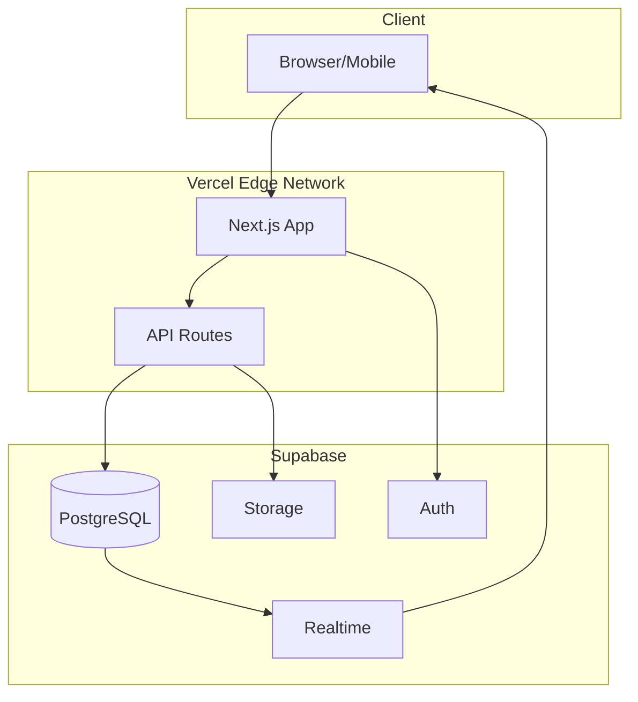
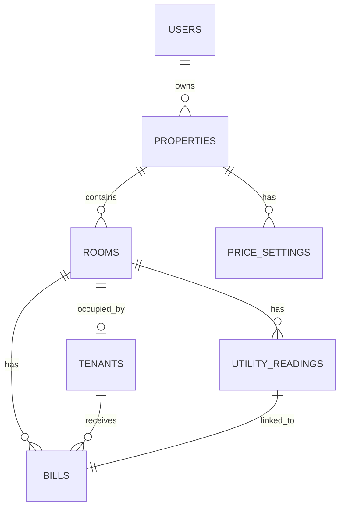
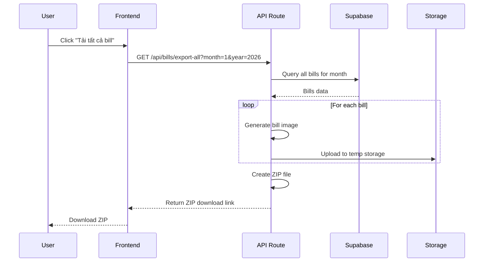
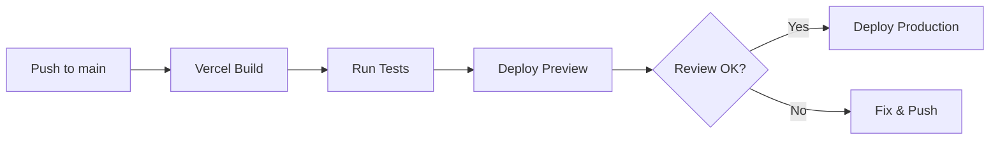

# Technical Requirements Document (TRD)
## Phần Mềm Quản Lý Nhà Trọ - RentManager

---

## 1. Tổng Quan Kiến Trúc

### 1.1 Technology Stack

| Layer | Technology | Lý do chọn |
|-------|------------|------------|
| **Frontend** | Next.js 14 (App Router) | SSR tốt, deploy Vercel dễ dàng |
| **Styling** | Tailwind CSS + shadcn/ui | UI đẹp, responsive, dễ customize |
| **Backend** | Next.js API Routes | Serverless, tích hợp sẵn với Vercel |
| **Database** | Supabase (PostgreSQL) | Realtime, Auth sẵn, free tier tốt |
| **Storage** | Supabase Storage | Lưu ảnh bill, CCCD |
| **Hosting** | Vercel | Free, auto deploy, edge network |
| **Auth** | Supabase Auth | Email/Password, có thể thêm Google |

### 1.2 Kiến Trúc Tổng Quan



---

## 2. Database Schema

### 2.1 Supabase Tables

```sql
-- Bảng nhà trọ (1 user có thể quản lý nhiều nhà)
CREATE TABLE properties (
    id UUID PRIMARY KEY DEFAULT gen_random_uuid(),
    user_id UUID REFERENCES auth.users(id) ON DELETE CASCADE,
    name VARCHAR(255) NOT NULL,
    address TEXT,
    logo_url TEXT,
    created_at TIMESTAMPTZ DEFAULT NOW(),
    updated_at TIMESTAMPTZ DEFAULT NOW()
);

-- Bảng phòng trọ
CREATE TABLE rooms (
    id UUID PRIMARY KEY DEFAULT gen_random_uuid(),
    property_id UUID REFERENCES properties(id) ON DELETE CASCADE,
    name VARCHAR(100) NOT NULL,
    floor INTEGER DEFAULT 1,
    area DECIMAL(10,2), -- diện tích m²
    base_rent DECIMAL(15,2) NOT NULL, -- giá thuê cơ bản
    status VARCHAR(20) DEFAULT 'vacant', -- 'occupied', 'vacant'
    created_at TIMESTAMPTZ DEFAULT NOW(),
    updated_at TIMESTAMPTZ DEFAULT NOW()
);

-- Bảng người thuê
CREATE TABLE tenants (
    id UUID PRIMARY KEY DEFAULT gen_random_uuid(),
    room_id UUID REFERENCES rooms(id) ON DELETE SET NULL,
    full_name VARCHAR(255) NOT NULL,
    phone VARCHAR(20),
    email VARCHAR(255),
    id_card VARCHAR(20), -- CMND/CCCD
    id_card_image_url TEXT,
    move_in_date DATE,
    move_out_date DATE,
    is_active BOOLEAN DEFAULT TRUE,
    created_at TIMESTAMPTZ DEFAULT NOW(),
    updated_at TIMESTAMPTZ DEFAULT NOW()
);

-- Bảng cấu hình đơn giá
CREATE TABLE price_settings (
    id UUID PRIMARY KEY DEFAULT gen_random_uuid(),
    property_id UUID REFERENCES properties(id) ON DELETE CASCADE,
    electricity_price DECIMAL(10,2) NOT NULL, -- đ/kWh
    water_price DECIMAL(10,2) NOT NULL, -- đ/m³
    service_fee DECIMAL(15,2) DEFAULT 0, -- phí dịch vụ cố định
    wifi_fee DECIMAL(15,2) DEFAULT 0,
    garbage_fee DECIMAL(15,2) DEFAULT 0,
    effective_from DATE NOT NULL,
    created_at TIMESTAMPTZ DEFAULT NOW()
);

-- Bảng ghi số điện nước hàng tháng
CREATE TABLE utility_readings (
    id UUID PRIMARY KEY DEFAULT gen_random_uuid(),
    room_id UUID REFERENCES rooms(id) ON DELETE CASCADE,
    month INTEGER NOT NULL, -- 1-12
    year INTEGER NOT NULL,
    
    -- Số điện
    electricity_start DECIMAL(10,2) NOT NULL,
    electricity_end DECIMAL(10,2) NOT NULL,
    electricity_used DECIMAL(10,2) GENERATED ALWAYS AS (electricity_end - electricity_start) STORED,
    
    -- Số nước
    water_start DECIMAL(10,2) NOT NULL,
    water_end DECIMAL(10,2) NOT NULL,
    water_used DECIMAL(10,2) GENERATED ALWAYS AS (water_end - water_start) STORED,
    
    created_at TIMESTAMPTZ DEFAULT NOW(),
    updated_at TIMESTAMPTZ DEFAULT NOW(),
    
    UNIQUE(room_id, month, year)
);

-- Bảng hóa đơn (bills)
CREATE TABLE bills (
    id UUID PRIMARY KEY DEFAULT gen_random_uuid(),
    room_id UUID REFERENCES rooms(id) ON DELETE CASCADE,
    tenant_id UUID REFERENCES tenants(id) ON DELETE SET NULL,
    utility_reading_id UUID REFERENCES utility_readings(id),
    
    month INTEGER NOT NULL,
    year INTEGER NOT NULL,
    
    -- Chi tiết tiền
    room_rent DECIMAL(15,2) NOT NULL,
    electricity_amount DECIMAL(15,2) NOT NULL,
    water_amount DECIMAL(15,2) NOT NULL,
    service_fee DECIMAL(15,2) DEFAULT 0,
    other_fee DECIMAL(15,2) DEFAULT 0,
    other_fee_note TEXT,
    total_amount DECIMAL(15,2) NOT NULL,
    
    -- Trạng thái
    status VARCHAR(20) DEFAULT 'pending', -- 'pending', 'paid'
    paid_at TIMESTAMPTZ,
    
    -- Ảnh bill đã xuất
    bill_image_url TEXT,
    
    created_at TIMESTAMPTZ DEFAULT NOW(),
    updated_at TIMESTAMPTZ DEFAULT NOW(),
    
    UNIQUE(room_id, month, year)
);
```

### 2.2 Row Level Security (RLS)

```sql
-- Enable RLS cho tất cả tables
ALTER TABLE properties ENABLE ROW LEVEL SECURITY;
ALTER TABLE rooms ENABLE ROW LEVEL SECURITY;
ALTER TABLE tenants ENABLE ROW LEVEL SECURITY;
ALTER TABLE price_settings ENABLE ROW LEVEL SECURITY;
ALTER TABLE utility_readings ENABLE ROW LEVEL SECURITY;
ALTER TABLE bills ENABLE ROW LEVEL SECURITY;

-- Policy: User chỉ thấy data của mình
CREATE POLICY "Users can view own properties" ON properties
    FOR ALL USING (auth.uid() = user_id);

CREATE POLICY "Users can view own rooms" ON rooms
    FOR ALL USING (
        property_id IN (SELECT id FROM properties WHERE user_id = auth.uid())
    );

-- Tương tự cho các bảng khác...
```

### 2.3 Entity Relationship Diagram



---

## 3. Cấu Trúc Project

```
rent-manager/
├── app/
│   ├── (auth)/
│   │   ├── login/page.tsx
│   │   └── register/page.tsx
│   ├── (dashboard)/
│   │   ├── layout.tsx
│   │   ├── page.tsx                    # Dashboard
│   │   ├── rooms/
│   │   │   ├── page.tsx                # Danh sách phòng
│   │   │   ├── [id]/page.tsx           # Chi tiết phòng
│   │   │   └── new/page.tsx            # Thêm phòng
│   │   ├── tenants/
│   │   │   ├── page.tsx
│   │   │   └── [id]/page.tsx
│   │   ├── utilities/
│   │   │   ├── page.tsx                # Nhập số điện nước
│   │   │   └── [month]/page.tsx
│   │   ├── bills/
│   │   │   ├── page.tsx                # Danh sách bills
│   │   │   ├── [id]/page.tsx           # Preview bill
│   │   │   └── export/page.tsx         # Xuất tất cả bills
│   │   └── settings/
│   │       └── page.tsx                # Cấu hình
│   ├── api/
│   │   ├── rooms/route.ts
│   │   ├── tenants/route.ts
│   │   ├── utilities/route.ts
│   │   ├── bills/
│   │   │   ├── route.ts
│   │   │   ├── generate/route.ts       # Tạo bill
│   │   │   └── export-all/route.ts     # Xuất tất cả
│   │   └── settings/route.ts
│   ├── layout.tsx
│   └── globals.css
├── components/
│   ├── ui/                             # shadcn components
│   ├── rooms/
│   │   ├── RoomCard.tsx
│   │   ├── RoomForm.tsx
│   │   └── RoomList.tsx
│   ├── bills/
│   │   ├── BillPreview.tsx
│   │   ├── BillTemplate.tsx            # Mẫu bill để render
│   │   └── ExportButton.tsx
│   ├── utilities/
│   │   ├── UtilityInputForm.tsx
│   │   └── UtilityTable.tsx
│   └── layout/
│       ├── Sidebar.tsx
│       ├── Header.tsx
│       └── DashboardLayout.tsx
├── lib/
│   ├── supabase/
│   │   ├── client.ts                   # Browser client
│   │   ├── server.ts                   # Server client
│   │   └── middleware.ts
│   ├── utils/
│   │   ├── bill-generator.ts           # Tạo ảnh bill
│   │   ├── formatters.ts               # Format tiền, ngày
│   │   └── validators.ts
│   └── types/
│       └── database.ts                 # Types từ Supabase
├── hooks/
│   ├── useRooms.ts
│   ├── useBills.ts
│   └── useUtilities.ts
├── public/
│   └── bill-template/
│       └── default-logo.png
├── middleware.ts                       # Auth middleware
├── package.json
├── tailwind.config.ts
└── next.config.js
```

---

## 4. API Endpoints

### 4.1 Rooms API

| Method | Endpoint | Mô tả |
|--------|----------|-------|
| GET | `/api/rooms` | Lấy danh sách phòng |
| POST | `/api/rooms` | Tạo phòng mới |
| GET | `/api/rooms/[id]` | Chi tiết phòng |
| PUT | `/api/rooms/[id]` | Cập nhật phòng |
| DELETE | `/api/rooms/[id]` | Xóa phòng |

### 4.2 Utilities API

| Method | Endpoint | Mô tả |
|--------|----------|-------|
| GET | `/api/utilities?month=1&year=2026` | Lấy số điện nước theo tháng |
| POST | `/api/utilities` | Nhập số điện nước |
| PUT | `/api/utilities/[id]` | Sửa số điện nước |

### 4.3 Bills API

| Method | Endpoint | Mô tả |
|--------|----------|-------|
| GET | `/api/bills?month=1&year=2026` | Danh sách bills theo tháng |
| POST | `/api/bills/generate` | Tạo bills tự động cho tháng |
| GET | `/api/bills/[id]` | Chi tiết bill |
| GET | `/api/bills/export-all?month=1&year=2026` | Xuất ZIP tất cả bills |

---

## 5. Tính Năng Xuất Bill

### 5.1 Bill Template Design

```tsx
// components/bills/BillTemplate.tsx
// Sử dụng html2canvas hoặc @react-pdf/renderer

interface BillData {
  roomName: string;
  tenantName: string;
  month: number;
  year: number;
  roomRent: number;
  electricityUsed: number;
  electricityPrice: number;
  electricityAmount: number;
  waterUsed: number;
  waterPrice: number;
  waterAmount: number;
  serviceFee: number;
  totalAmount: number;
  propertyInfo: {
    name: string;
    address: string;
    phone: string;
    logo?: string;
  };
}
```

### 5.2 Export All Bills Flow



### 5.3 Thư viện sử dụng

| Chức năng | Thư viện | Mục đích |
|-----------|----------|----------|
| Render HTML to Image | `html2canvas` | Chuyển bill component thành ảnh |
| PDF Generation | `@react-pdf/renderer` | Tạo PDF (optional) |
| ZIP Files | `jszip` | Nén nhiều file bill |
| File Download | `file-saver` | Trigger download browser |

---

## 6. Authentication Flow

### 6.1 Supabase Auth Integration

```tsx
// middleware.ts
import { createMiddlewareClient } from '@supabase/auth-helpers-nextjs';
import { NextResponse } from 'next/server';
import type { NextRequest } from 'next/server';

export async function middleware(req: NextRequest) {
  const res = NextResponse.next();
  const supabase = createMiddlewareClient({ req, res });
  const { data: { session } } = await supabase.auth.getSession();

  // Redirect to login nếu chưa auth
  if (!session && req.nextUrl.pathname.startsWith('/dashboard')) {
    return NextResponse.redirect(new URL('/login', req.url));
  }

  return res;
}
```

---

## 7. Deployment

### 7.1 Vercel Configuration

```json
// vercel.json
{
  "framework": "nextjs",
  "regions": ["sin1"],  // Singapore region cho VN users
  "env": {
    "NEXT_PUBLIC_SUPABASE_URL": "@supabase_url",
    "NEXT_PUBLIC_SUPABASE_ANON_KEY": "@supabase_anon_key",
    "SUPABASE_SERVICE_ROLE_KEY": "@supabase_service_role_key"
  }
}
```

### 7.2 Environment Variables

| Variable | Mô tả | Visibility |
|----------|-------|------------|
| `NEXT_PUBLIC_SUPABASE_URL` | Supabase project URL | Public |
| `NEXT_PUBLIC_SUPABASE_ANON_KEY` | Supabase anon key | Public |
| `SUPABASE_SERVICE_ROLE_KEY` | Service role key | Server only |

### 7.3 CI/CD Pipeline



---

## 8. Performance Considerations

### 8.1 Optimizations

| Aspect | Strategy |
|--------|----------|
| **Database** | Index trên `room_id`, `month`, `year` |
| **Images** | Lazy loading, WebP format |
| **API** | Pagination cho danh sách lớn |
| **Caching** | SWR/React Query cho client |
| **Bundle** | Dynamic imports cho bill generation |

### 8.2 Scalability

- Supabase PostgreSQL tự scale
- Vercel serverless functions auto-scale
- Storage sử dụng Supabase CDN

---

## 9. Security Checklist

- [x] Row Level Security (RLS) enabled
- [x] HTTPS everywhere (Vercel default)
- [x] Environment variables cho secrets
- [x] Input validation server-side
- [x] SQL injection prevention (Supabase client)
- [x] XSS protection (Next.js default)
- [ ] Rate limiting (Vercel config)

---

## 10. Development Timeline

| Phase | Duration | Deliverables |
|-------|----------|--------------|
| **Setup** | 1 ngày | Project init, Supabase setup, Auth |
| **Core Features** | 3-4 ngày | Rooms, Tenants, Utilities CRUD |
| **Bill Generation** | 2 ngày | Bill template, Generate, Preview |
| **Export Feature** | 1 ngày | Export 1 click, ZIP download |
| **Polish** | 1-2 ngày | UI/UX polish, Testing |
| **Deploy** | 0.5 ngày | Vercel deploy, Domain setup |

> [!TIP]
> **Tổng thời gian ước tính MVP**: 8-10 ngày phát triển
