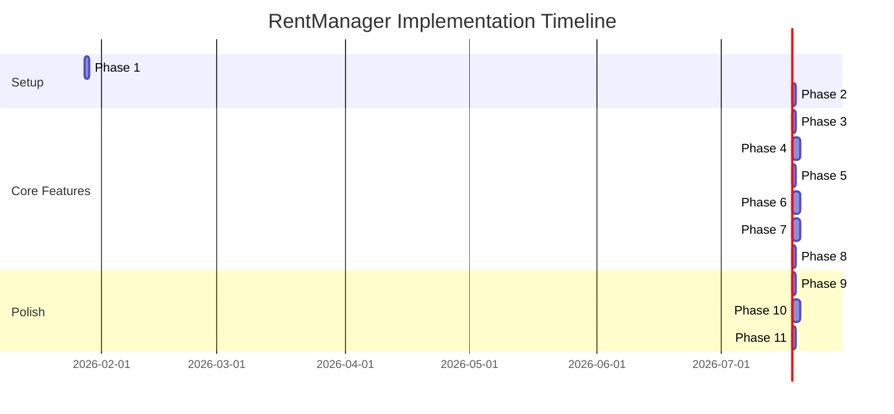

# Implementation & Verification Test Plan
## RentManager - Rent Management System

| Info | Details |
|------|---------|
| **Version** | 1.0 |
| **Date** | 2026-01-27 |
| **Based on** | PRD v1.1, TRD v1.1 |
| **Skills Used** | plan-writing, testing-patterns, test-driven-development |

---

## Table of Contents

1. [Overview](#1-overview)
2. [Technology Stack Summary](#2-technology-stack-summary)
3. [Implementation Phases](#3-implementation-phases)
4. [Phase 1: Project Setup & Infrastructure](#phase-1-project-setup--infrastructure)
5. [Phase 2: Authentication System](#phase-2-authentication-system)
6. [Phase 3: Core Data Models & Database](#phase-3-core-data-models--database)
7. [Phase 4: Room Management (CRUD)](#phase-4-room-management-crud)
8. [Phase 5: Tenant Management](#phase-5-tenant-management)
9. [Phase 6: Utility Readings](#phase-6-utility-readings)
10. [Phase 7: Bill Generation](#phase-7-bill-generation)
11. [Phase 8: Export Features](#phase-8-export-features)
12. [Phase 9: Settings & Configuration](#phase-9-settings--configuration)
13. [Phase 10: Responsive UI & PWA](#phase-10-responsive-ui--pwa)
14. [Phase 11: Final Integration & Polish](#phase-11-final-integration--polish)
15. [Test Strategy](#test-strategy)
16. [Verification Checklist](#verification-checklist)

---

## 1. Overview

### Goal
Build a rent management web application that enables landlords to:
- Manage rental rooms and tenants
- Track monthly electricity and water consumption
- Automatically calculate and generate professional bills
- Export all bills with one click

### Success Criteria
| Metric | Target |
|--------|--------|
| Bill generation for 10 rooms | < 5 minutes |
| Calculation accuracy | 100% |
| Steps to export all bills | <= 3 clicks |
| First Contentful Paint | < 1.5s |
| App load time | < 3s |

---

## 2. Technology Stack Summary

| Layer | Technology |
|-------|------------|
| Frontend | Next.js 14 (App Router) |
| Styling | Tailwind CSS v3.4+ + shadcn/ui |
| Animations | Framer Motion |
| Backend | Next.js API Routes |
| Database | Supabase (PostgreSQL) |
| Storage | Supabase Storage |
| Auth | Supabase Auth |
| Hosting | Vercel |
| PWA | next-pwa |

---

## 3. Implementation Phases



---

## Phase 1: Project Setup & Infrastructure

### Tasks

| # | Task | Verification |
|---|------|--------------|
| 1.1 | Initialize Next.js 14 with App Router | `npx create-next-app@latest --typescript` succeeds |
| 1.2 | Install and configure Tailwind CSS | `tailwind.config.ts` exists, test class works |
| 1.3 | Install shadcn/ui with custom theme | `npx shadcn@latest init` completes, `components/ui/` populated |
| 1.4 | Install Framer Motion | `npm install framer-motion` succeeds |
| 1.5 | Configure ESLint & Prettier | `npm run lint` passes |
| 1.6 | Set up project folder structure per TRD | All directories exist as specified |
| 1.7 | Configure environment variables | `.env.local` template created |
| 1.8 | Set up Vitest for unit testing | `npm run test` runs successfully |
| 1.9 | Set up Playwright for E2E testing | `npx playwright test --help` works |

### Unit Tests (Vitest)

```typescript
// __tests__/setup.test.ts
describe('Project Setup', () => {
  it('should have Next.js configured correctly', () => {
    const nextConfig = require('../next.config.ts');
    expect(nextConfig).toBeDefined();
  });

  it('should have Tailwind configured', () => {
    const tailwindConfig = require('../tailwind.config.ts');
    expect(tailwindConfig.content).toBeDefined();
  });
});
```

### Verification Commands

```bash
# Verify Next.js setup
npm run dev  # Should start on localhost:3000

# Verify Tailwind
# Add class="text-blue-500" to a component, verify color appears

# Verify shadcn
npx shadcn@latest add button  # Should add Button component

# Verify testing
npm run test  # Should pass
```

---

## Phase 2: Authentication System

### Tasks

| # | Task | Verification |
|---|------|--------------|
| 2.1 | Create Supabase project | Dashboard accessible at supabase.com |
| 2.2 | Install Supabase client libraries | `@supabase/supabase-js`, `@supabase/auth-helpers-nextjs` installed |
| 2.3 | Configure Supabase environment variables | `.env.local` has all required keys |
| 2.4 | Create `lib/supabase/client.ts` (browser) | Import works without errors |
| 2.5 | Create `lib/supabase/server.ts` (server) | Server-side client initializes |
| 2.6 | Create auth middleware | Unauthenticated users redirected from `/dashboard` |
| 2.7 | Build Login page `/login` | Page renders, form visible |
| 2.8 | Build Register page `/register` | Page renders, form visible |
| 2.9 | Implement email/password sign-up | New user created in Supabase |
| 2.10 | Implement email/password sign-in | Session established, redirected to dashboard |
| 2.11 | Implement sign-out | Session cleared, redirected to login |

### Unit Tests

```typescript
// __tests__/auth/validation.test.ts
import { validateEmail, validatePassword } from '@/lib/utils/validators';

describe('Auth Validation', () => {
  describe('validateEmail', () => {
    it('should accept valid email', () => {
      expect(validateEmail('test@example.com')).toBe(true);
    });

    it('should reject invalid email', () => {
      expect(validateEmail('invalid-email')).toBe(false);
    });

    it('should reject empty email', () => {
      expect(validateEmail('')).toBe(false);
    });
  });

  describe('validatePassword', () => {
    it('should accept password with 8+ characters', () => {
      expect(validatePassword('password123')).toBe(true);
    });

    it('should reject password under 8 characters', () => {
      expect(validatePassword('pass')).toBe(false);
    });
  });
});
```

### Integration Tests

```typescript
// __tests__/auth/auth-flow.test.ts
import { createClient } from '@/lib/supabase/client';

describe('Auth Flow', () => {
  const testEmail = `test-${Date.now()}@example.com`;
  const testPassword = 'TestPassword123!';

  it('should create new user account', async () => {
    const supabase = createClient();
    const { data, error } = await supabase.auth.signUp({
      email: testEmail,
      password: testPassword,
    });

    expect(error).toBeNull();
    expect(data.user).toBeDefined();
  });

  it('should sign in existing user', async () => {
    const supabase = createClient();
    const { data, error } = await supabase.auth.signInWithPassword({
      email: testEmail,
      password: testPassword,
    });

    expect(error).toBeNull();
    expect(data.session).toBeDefined();
  });
});
```

### E2E Tests (Playwright)

```typescript
// e2e/auth.spec.ts
import { test, expect } from '@playwright/test';

test.describe('Authentication', () => {
  test('should redirect unauthenticated user to login', async ({ page }) => {
    await page.goto('/dashboard');
    await expect(page).toHaveURL(/.*login/);
  });

  test('should show error for invalid credentials', async ({ page }) => {
    await page.goto('/login');
    await page.fill('[name=email]', 'wrong@email.com');
    await page.fill('[name=password]', 'wrongpassword');
    await page.click('button[type=submit]');

    await expect(page.locator('text=Invalid')).toBeVisible();
  });

  test('should login successfully with valid credentials', async ({ page }) => {
    await page.goto('/login');
    await page.fill('[name=email]', process.env.TEST_USER_EMAIL!);
    await page.fill('[name=password]', process.env.TEST_USER_PASSWORD!);
    await page.click('button[type=submit]');

    await expect(page).toHaveURL('/dashboard');
  });
});
```

---

## Phase 3: Core Data Models & Database

### Tasks

| # | Task | Verification |
|---|------|--------------|
| 3.1 | Create `properties` table in Supabase | Table visible in Supabase dashboard |
| 3.2 | Create `rooms` table | Table has all columns per TRD |
| 3.3 | Create `tenants` table | Foreign key to rooms works |
| 3.4 | Create `price_settings` table | Table created with constraints |
| 3.5 | Create `utility_readings` table | Generated columns work correctly |
| 3.6 | Create `bills` table | All foreign keys established |
| 3.7 | Enable Row Level Security (RLS) | RLS enabled on all tables |
| 3.8 | Create RLS policies | Users can only see their own data |
| 3.9 | Create database indexes | Indexes visible in Supabase |
| 3.10 | Generate TypeScript types | `lib/types/database.ts` generated |
| 3.11 | Create Zod validation schemas | Schemas compile without errors |

### Unit Tests

```typescript
// __tests__/validations/schemas.test.ts
import { createRoomSchema, utilityReadingSchema } from '@/lib/validations';

describe('Validation Schemas', () => {
  describe('createRoomSchema', () => {
    it('should validate correct room data', () => {
      const validRoom = {
        name: 'Room 101',
        floor: 1,
        area: 25.5,
        base_rent: 3000000,
      };

      const result = createRoomSchema.safeParse(validRoom);
      expect(result.success).toBe(true);
    });

    it('should reject room without name', () => {
      const invalidRoom = {
        floor: 1,
        base_rent: 3000000,
      };

      const result = createRoomSchema.safeParse(invalidRoom);
      expect(result.success).toBe(false);
    });

    it('should reject negative rent', () => {
      const invalidRoom = {
        name: 'Room 101',
        base_rent: -1000,
      };

      const result = createRoomSchema.safeParse(invalidRoom);
      expect(result.success).toBe(false);
    });
  });

  describe('utilityReadingSchema', () => {
    it('should calculate consumption correctly', () => {
      const reading = {
        electricity_start: 100,
        electricity_end: 150,
        water_start: 50,
        water_end: 60,
      };

      // electricity_used = 150 - 100 = 50
      // water_used = 60 - 50 = 10
      expect(reading.electricity_end - reading.electricity_start).toBe(50);
      expect(reading.water_end - reading.water_start).toBe(10);
    });

    it('should reject when end < start', () => {
      const invalidReading = {
        electricity_start: 150,
        electricity_end: 100, // Invalid: end < start
        water_start: 50,
        water_end: 60,
      };

      const result = utilityReadingSchema.safeParse(invalidReading);
      expect(result.success).toBe(false);
    });
  });
});
```

### Database Tests

```typescript
// __tests__/database/rls.test.ts
describe('Row Level Security', () => {
  it('should prevent user from accessing other users properties', async () => {
    const supabase = createClient();

    // Sign in as user A
    await supabase.auth.signInWithPassword({
      email: 'usera@test.com',
      password: 'password',
    });

    // Try to access user B's property
    const { data, error } = await supabase
      .from('properties')
      .select('*')
      .eq('user_id', 'user-b-id');

    expect(data).toHaveLength(0); // RLS should filter this
  });

  it('should allow user to access their own properties', async () => {
    const supabase = createClient();

    await supabase.auth.signInWithPassword({
      email: 'usera@test.com',
      password: 'password',
    });

    const { data, error } = await supabase
      .from('properties')
      .select('*');

    expect(error).toBeNull();
    // Should return only user A's properties
  });
});
```

---

## Phase 4: Room Management (CRUD)

### Tasks

| # | Task | Verification |
|---|------|--------------|
| 4.1 | Create `GET /api/rooms` endpoint | Returns array of rooms |
| 4.2 | Create `POST /api/rooms` endpoint | New room created in database |
| 4.3 | Create `GET /api/rooms/[id]` endpoint | Returns single room details |
| 4.4 | Create `PUT /api/rooms/[id]` endpoint | Room updated in database |
| 4.5 | Create `DELETE /api/rooms/[id]` endpoint | Room removed from database |
| 4.6 | Build `RoomCard` component | Displays room info correctly |
| 4.7 | Build `RoomList` component | Shows all rooms with cards |
| 4.8 | Build `RoomForm` component | Form validates input |
| 4.9 | Build rooms list page `/dashboard/rooms` | Page renders room list |
| 4.10 | Build room detail page `/dashboard/rooms/[id]` | Shows full room info |
| 4.11 | Build add room page `/dashboard/rooms/new` | Form creates new room |
| 4.12 | Implement edit room functionality | Changes saved to database |
| 4.13 | Implement delete room with confirmation | Room deleted after confirm |
| 4.14 | Add loading states (Skeleton UI) | Skeleton shows during load |
| 4.15 | Add empty state | Illustrated empty state shown |
| 4.16 | Add error handling | Error toast on failure |

### Unit Tests

```typescript
// __tests__/components/rooms/RoomCard.test.tsx
import { render, screen } from '@testing-library/react';
import { RoomCard } from '@/components/rooms/RoomCard';
import { getMockRoom } from '@/test-utils/factories';

describe('RoomCard', () => {
  it('should render room name', () => {
    const room = getMockRoom({ name: 'Phong 101' });
    render(<RoomCard room={room} />);

    expect(screen.getByText('Phong 101')).toBeInTheDocument();
  });

  it('should show occupied status when tenant exists', () => {
    const room = getMockRoom({ status: 'occupied' });
    render(<RoomCard room={room} />);

    expect(screen.getByText(/dang thue/i)).toBeInTheDocument();
  });

  it('should show vacant status when no tenant', () => {
    const room = getMockRoom({ status: 'vacant' });
    render(<RoomCard room={room} />);

    expect(screen.getByText(/trong/i)).toBeInTheDocument();
  });

  it('should display formatted rent price', () => {
    const room = getMockRoom({ base_rent: 3000000 });
    render(<RoomCard room={room} />);

    expect(screen.getByText('3.000.000 d')).toBeInTheDocument();
  });
});
```

```typescript
// __tests__/components/rooms/RoomForm.test.tsx
import { render, screen, fireEvent, waitFor } from '@testing-library/react';
import { RoomForm } from '@/components/rooms/RoomForm';

describe('RoomForm', () => {
  const mockOnSubmit = vi.fn();

  beforeEach(() => {
    vi.clearAllMocks();
  });

  it('should render all form fields', () => {
    render(<RoomForm onSubmit={mockOnSubmit} />);

    expect(screen.getByLabelText(/ten phong/i)).toBeInTheDocument();
    expect(screen.getByLabelText(/tang/i)).toBeInTheDocument();
    expect(screen.getByLabelText(/dien tich/i)).toBeInTheDocument();
    expect(screen.getByLabelText(/gia thue/i)).toBeInTheDocument();
  });

  it('should show validation error for empty room name', async () => {
    render(<RoomForm onSubmit={mockOnSubmit} />);

    fireEvent.click(screen.getByRole('button', { name: /luu/i }));

    await waitFor(() => {
      expect(screen.getByText(/ten phong khong duoc trong/i)).toBeInTheDocument();
    });

    expect(mockOnSubmit).not.toHaveBeenCalled();
  });

  it('should call onSubmit with valid data', async () => {
    render(<RoomForm onSubmit={mockOnSubmit} />);

    fireEvent.change(screen.getByLabelText(/ten phong/i), {
      target: { value: 'Phong 101' },
    });
    fireEvent.change(screen.getByLabelText(/gia thue/i), {
      target: { value: '3000000' },
    });
    fireEvent.click(screen.getByRole('button', { name: /luu/i }));

    await waitFor(() => {
      expect(mockOnSubmit).toHaveBeenCalledWith(
        expect.objectContaining({
          name: 'Phong 101',
          base_rent: 3000000,
        })
      );
    });
  });
});
```

### API Tests

```typescript
// __tests__/api/rooms.test.ts
import { createMocks } from 'node-mocks-http';
import { GET, POST } from '@/app/api/rooms/route';

describe('Rooms API', () => {
  describe('GET /api/rooms', () => {
    it('should return 401 for unauthenticated requests', async () => {
      const { req, res } = createMocks({ method: 'GET' });
      const response = await GET(req);

      expect(response.status).toBe(401);
    });

    it('should return rooms for authenticated user', async () => {
      // Mock authenticated request
      const { req, res } = createMocks({
        method: 'GET',
        headers: { Authorization: 'Bearer valid-token' },
      });

      const response = await GET(req);
      const data = await response.json();

      expect(response.status).toBe(200);
      expect(Array.isArray(data)).toBe(true);
    });
  });

  describe('POST /api/rooms', () => {
    it('should create new room with valid data', async () => {
      const { req, res } = createMocks({
        method: 'POST',
        headers: { Authorization: 'Bearer valid-token' },
        body: {
          name: 'Phong 101',
          floor: 1,
          base_rent: 3000000,
          property_id: 'valid-property-id',
        },
      });

      const response = await POST(req);
      const data = await response.json();

      expect(response.status).toBe(201);
      expect(data.name).toBe('Phong 101');
    });

    it('should return 400 for invalid data', async () => {
      const { req, res } = createMocks({
        method: 'POST',
        headers: { Authorization: 'Bearer valid-token' },
        body: {
          name: '', // Invalid: empty name
          base_rent: -1000, // Invalid: negative rent
        },
      });

      const response = await POST(req);

      expect(response.status).toBe(400);
    });
  });
});
```

### E2E Tests

```typescript
// e2e/rooms.spec.ts
import { test, expect } from '@playwright/test';

test.describe('Room Management', () => {
  test.beforeEach(async ({ page }) => {
    // Login before each test
    await page.goto('/login');
    await page.fill('[name=email]', process.env.TEST_USER_EMAIL!);
    await page.fill('[name=password]', process.env.TEST_USER_PASSWORD!);
    await page.click('button[type=submit]');
    await page.waitForURL('/dashboard');
  });

  test('should display rooms list', async ({ page }) => {
    await page.goto('/dashboard/rooms');
    await expect(page.locator('h1')).toContainText('Danh sach phong');
  });

  test('should create new room', async ({ page }) => {
    await page.goto('/dashboard/rooms/new');

    await page.fill('[name=name]', 'Phong Test 101');
    await page.fill('[name=floor]', '1');
    await page.fill('[name=area]', '25');
    await page.fill('[name=base_rent]', '3000000');
    await page.click('button[type=submit]');

    await expect(page).toHaveURL('/dashboard/rooms');
    await expect(page.locator('text=Phong Test 101')).toBeVisible();
  });

  test('should edit existing room', async ({ page }) => {
    await page.goto('/dashboard/rooms');
    await page.click('text=Phong Test 101');
    await page.click('button:has-text("Sua")');

    await page.fill('[name=base_rent]', '3500000');
    await page.click('button[type=submit]');

    await expect(page.locator('text=3.500.000')).toBeVisible();
  });

  test('should delete room with confirmation', async ({ page }) => {
    await page.goto('/dashboard/rooms');
    await page.click('text=Phong Test 101');
    await page.click('button:has-text("Xoa")');

    // Confirmation dialog
    await page.click('button:has-text("Xac nhan")');

    await expect(page.locator('text=Phong Test 101')).not.toBeVisible();
  });
});
```

---

## Phase 5: Tenant Management

### Tasks

| # | Task | Verification |
|---|------|--------------|
| 5.1 | Create tenant API endpoints | CRUD operations work |
| 5.2 | Build `TenantCard` component | Shows tenant info |
| 5.3 | Build `TenantForm` component | Form validates input |
| 5.4 | Build tenants list page | Page renders |
| 5.5 | Build tenant detail page | Shows full tenant info |
| 5.6 | Implement room assignment | Tenant linked to room |
| 5.7 | Implement move-out functionality | Tenant unlinked, history saved |
| 5.8 | Add tenant history view | Shows previous rooms |

### Unit Tests

```typescript
// __tests__/components/tenants/TenantCard.test.tsx
import { render, screen } from '@testing-library/react';
import { TenantCard } from '@/components/tenants/TenantCard';
import { getMockTenant } from '@/test-utils/factories';

describe('TenantCard', () => {
  it('should display tenant name', () => {
    const tenant = getMockTenant({ full_name: 'Nguyen Van A' });
    render(<TenantCard tenant={tenant} />);

    expect(screen.getByText('Nguyen Van A')).toBeInTheDocument();
  });

  it('should display phone number', () => {
    const tenant = getMockTenant({ phone: '0912345678' });
    render(<TenantCard tenant={tenant} />);

    expect(screen.getByText('0912345678')).toBeInTheDocument();
  });

  it('should show active badge for active tenant', () => {
    const tenant = getMockTenant({ is_active: true });
    render(<TenantCard tenant={tenant} />);

    expect(screen.getByText(/dang o/i)).toBeInTheDocument();
  });
});
```

---

## Phase 6: Utility Readings

### Tasks

| # | Task | Verification |
|---|------|--------------|
| 6.1 | Create `GET /api/utilities` endpoint | Returns readings by month |
| 6.2 | Create `POST /api/utilities` endpoint | Saves new readings |
| 6.3 | Create `PUT /api/utilities/[id]` endpoint | Updates reading |
| 6.4 | Build `UtilityInputForm` component | Form for single room |
| 6.5 | Build `UtilityTable` component | Shows all rooms for month |
| 6.6 | Build utilities page `/dashboard/utilities` | Page renders |
| 6.7 | Implement bulk input feature | Input all rooms at once |
| 6.8 | Implement auto-carry-forward | Previous end = current start |
| 6.9 | Add validation (end >= start) | Error shown if end < start |
| 6.10 | Add consumption calculation display | Shows real-time usage |
| 6.11 | Add month/year selector | Can select different periods |

### Unit Tests

```typescript
// __tests__/utils/calculations.test.ts
import {
  calculateElectricityAmount,
  calculateWaterAmount,
  calculateTotalBill
} from '@/lib/utils/calculations';

describe('Bill Calculations', () => {
  describe('calculateElectricityAmount', () => {
    it('should calculate electricity cost correctly', () => {
      const used = 150; // kWh
      const price = 3500; // VND/kWh

      const result = calculateElectricityAmount(used, price);

      expect(result).toBe(525000); // 150 * 3500
    });

    it('should return 0 for zero usage', () => {
      expect(calculateElectricityAmount(0, 3500)).toBe(0);
    });
  });

  describe('calculateWaterAmount', () => {
    it('should calculate water cost correctly', () => {
      const used = 10; // m3
      const price = 15000; // VND/m3

      const result = calculateWaterAmount(used, price);

      expect(result).toBe(150000); // 10 * 15000
    });
  });

  describe('calculateTotalBill', () => {
    it('should sum all components correctly', () => {
      const components = {
        roomRent: 3000000,
        electricityAmount: 525000,
        waterAmount: 150000,
        serviceFee: 100000,
        otherFee: 50000,
      };

      const result = calculateTotalBill(components);

      expect(result).toBe(3825000);
    });
  });
});
```

```typescript
// __tests__/components/utilities/UtilityInputForm.test.tsx
import { render, screen, fireEvent } from '@testing-library/react';
import { UtilityInputForm } from '@/components/utilities/UtilityInputForm';

describe('UtilityInputForm', () => {
  it('should show error when electricity end < start', async () => {
    const mockOnSubmit = vi.fn();
    render(
      <UtilityInputForm
        room={getMockRoom()}
        previousReading={{ electricity_end: 100, water_end: 50 }}
        onSubmit={mockOnSubmit}
      />
    );

    // Start should be auto-filled from previous
    expect(screen.getByLabelText(/so dien dau ky/i)).toHaveValue('100');

    // Enter invalid end value (less than start)
    fireEvent.change(screen.getByLabelText(/so dien cuoi ky/i), {
      target: { value: '90' },
    });

    fireEvent.click(screen.getByRole('button', { name: /luu/i }));

    await waitFor(() => {
      expect(screen.getByText(/so cuoi ky phai lon hon dau ky/i)).toBeInTheDocument();
    });

    expect(mockOnSubmit).not.toHaveBeenCalled();
  });

  it('should calculate consumption in real-time', () => {
    render(
      <UtilityInputForm
        room={getMockRoom()}
        previousReading={{ electricity_end: 100, water_end: 50 }}
        onSubmit={vi.fn()}
      />
    );

    fireEvent.change(screen.getByLabelText(/so dien cuoi ky/i), {
      target: { value: '150' },
    });

    // Should show consumption: 150 - 100 = 50
    expect(screen.getByText('50 kWh')).toBeInTheDocument();
  });
});
```

### E2E Tests

```typescript
// e2e/utilities.spec.ts
import { test, expect } from '@playwright/test';

test.describe('Utility Readings', () => {
  test.beforeEach(async ({ page }) => {
    await loginAsTestUser(page);
  });

  test('should input utility readings for all rooms', async ({ page }) => {
    await page.goto('/dashboard/utilities');

    // Select month
    await page.selectOption('[name=month]', '1');
    await page.selectOption('[name=year]', '2026');

    // Fill in readings for first room
    const firstRow = page.locator('tr').nth(1);
    await firstRow.locator('[name=electricity_end]').fill('150');
    await firstRow.locator('[name=water_end]').fill('60');

    // Check consumption calculation
    await expect(firstRow.locator('.electricity-used')).toContainText('50');
    await expect(firstRow.locator('.water-used')).toContainText('10');

    // Save all
    await page.click('button:has-text("Luu tat ca")');

    await expect(page.locator('.toast-success')).toContainText('Da luu');
  });

  test('should show warning for invalid readings', async ({ page }) => {
    await page.goto('/dashboard/utilities');

    const firstRow = page.locator('tr').nth(1);

    // Enter invalid reading (end < start)
    await firstRow.locator('[name=electricity_end]').fill('50'); // Less than start (100)

    await expect(firstRow.locator('.error-message')).toContainText('So cuoi ky phai lon hon');
  });
});
```

---

## Phase 7: Bill Generation

### Tasks

| # | Task | Verification |
|---|------|--------------|
| 7.1 | Create `POST /api/bills/generate` endpoint | Bills created in database |
| 7.2 | Create `GET /api/bills` endpoint | Returns bills by month |
| 7.3 | Create `GET /api/bills/[id]` endpoint | Returns single bill |
| 7.4 | Build `BillTemplate` component | Bill layout renders |
| 7.5 | Build `BillPreview` component | Shows bill preview |
| 7.6 | Implement bill calculation logic | All amounts correct |
| 7.7 | Implement html2canvas integration | Bill converts to image |
| 7.8 | Build bills list page | Page renders |
| 7.9 | Build bill detail/preview page | Preview shows correctly |
| 7.10 | Implement single bill download | PNG/PDF downloads |
| 7.11 | Add bill status tracking (pending/paid) | Status updates work |

### Unit Tests

```typescript
// __tests__/utils/bill-generator.test.ts
import { generateBillData, formatBillNumber } from '@/lib/utils/bill-generator';

describe('Bill Generator', () => {
  describe('generateBillData', () => {
    it('should calculate all bill components correctly', () => {
      const input = {
        room: getMockRoom({ base_rent: 3000000 }),
        tenant: getMockTenant({ full_name: 'Nguyen Van A' }),
        utilityReading: getMockUtilityReading({
          electricity_used: 150,
          water_used: 10,
        }),
        priceSettings: getMockPriceSettings({
          electricity_price: 3500,
          water_price: 15000,
          service_fee: 100000,
        }),
        month: 1,
        year: 2026,
      };

      const result = generateBillData(input);

      expect(result.roomRent).toBe(3000000);
      expect(result.electricityAmount).toBe(525000); // 150 * 3500
      expect(result.waterAmount).toBe(150000); // 10 * 15000
      expect(result.serviceFee).toBe(100000);
      expect(result.totalAmount).toBe(3775000);
    });

    it('should handle zero utility usage', () => {
      const input = {
        room: getMockRoom({ base_rent: 3000000 }),
        tenant: getMockTenant(),
        utilityReading: getMockUtilityReading({
          electricity_used: 0,
          water_used: 0,
        }),
        priceSettings: getMockPriceSettings(),
        month: 1,
        year: 2026,
      };

      const result = generateBillData(input);

      expect(result.electricityAmount).toBe(0);
      expect(result.waterAmount).toBe(0);
    });
  });

  describe('formatBillNumber', () => {
    it('should format bill number correctly', () => {
      const result = formatBillNumber('Phong 101', 1, 2026);
      expect(result).toBe('Phong_101_01-2026');
    });
  });
});
```

```typescript
// __tests__/components/bills/BillTemplate.test.tsx
import { render, screen } from '@testing-library/react';
import { BillTemplate } from '@/components/bills/BillTemplate';
import { getMockBillData } from '@/test-utils/factories';

describe('BillTemplate', () => {
  it('should display all bill information', () => {
    const billData = getMockBillData({
      roomName: 'Phong 101',
      tenantName: 'Nguyen Van A',
      month: 1,
      year: 2026,
      roomRent: 3000000,
      electricityUsed: 150,
      electricityAmount: 525000,
      waterUsed: 10,
      waterAmount: 150000,
      serviceFee: 100000,
      totalAmount: 3775000,
    });

    render(<BillTemplate data={billData} />);

    expect(screen.getByText('Phong 101')).toBeInTheDocument();
    expect(screen.getByText('Nguyen Van A')).toBeInTheDocument();
    expect(screen.getByText('01/2026')).toBeInTheDocument();
    expect(screen.getByText('3.000.000 d')).toBeInTheDocument();
    expect(screen.getByText('150 kWh')).toBeInTheDocument();
    expect(screen.getByText('525.000 d')).toBeInTheDocument();
    expect(screen.getByText('10 m3')).toBeInTheDocument();
    expect(screen.getByText('150.000 d')).toBeInTheDocument();
    expect(screen.getByText('3.775.000 d')).toBeInTheDocument();
  });

  it('should display property information', () => {
    const billData = getMockBillData({
      propertyInfo: {
        name: 'Nha Tro ABC',
        address: '123 Nguyen Trai, Q1',
        phone: '0912345678',
      },
    });

    render(<BillTemplate data={billData} />);

    expect(screen.getByText('Nha Tro ABC')).toBeInTheDocument();
    expect(screen.getByText('123 Nguyen Trai, Q1')).toBeInTheDocument();
    expect(screen.getByText('0912345678')).toBeInTheDocument();
  });
});
```

### Integration Tests

```typescript
// __tests__/api/bills.test.ts
describe('Bills API', () => {
  describe('POST /api/bills/generate', () => {
    it('should generate bills for all rooms with utility readings', async () => {
      const { req, res } = createMocks({
        method: 'POST',
        headers: { Authorization: 'Bearer valid-token' },
        body: {
          month: 1,
          year: 2026,
          property_id: 'valid-property-id',
        },
      });

      const response = await POST(req);
      const data = await response.json();

      expect(response.status).toBe(201);
      expect(data.generated).toBeGreaterThan(0);
      expect(data.bills).toBeInstanceOf(Array);
    });

    it('should skip rooms without utility readings', async () => {
      // Setup: create room without utility reading for the month
      const { req, res } = createMocks({
        method: 'POST',
        headers: { Authorization: 'Bearer valid-token' },
        body: {
          month: 2, // No readings for this month
          year: 2026,
          property_id: 'valid-property-id',
        },
      });

      const response = await POST(req);
      const data = await response.json();

      expect(response.status).toBe(200);
      expect(data.skipped).toBeGreaterThan(0);
    });
  });
});
```

### E2E Tests

```typescript
// e2e/bills.spec.ts
import { test, expect } from '@playwright/test';

test.describe('Bill Generation', () => {
  test.beforeEach(async ({ page }) => {
    await loginAsTestUser(page);
  });

  test('should generate bills for a month', async ({ page }) => {
    // Ensure utility readings exist first
    await page.goto('/dashboard/bills');

    await page.selectOption('[name=month]', '1');
    await page.selectOption('[name=year]', '2026');
    await page.click('button:has-text("Tao bill")');

    // Wait for generation
    await page.waitForSelector('.toast-success');

    // Verify bills created
    const billCards = page.locator('.bill-card');
    await expect(billCards).toHaveCount(/* expected number */);
  });

  test('should preview bill with correct information', async ({ page }) => {
    await page.goto('/dashboard/bills');
    await page.click('.bill-card:first-child');

    // Verify preview shows all details
    await expect(page.locator('.bill-preview')).toBeVisible();
    await expect(page.locator('.bill-preview')).toContainText('Tien phong');
    await expect(page.locator('.bill-preview')).toContainText('Tien dien');
    await expect(page.locator('.bill-preview')).toContainText('Tien nuoc');
    await expect(page.locator('.bill-preview')).toContainText('Tong cong');
  });

  test('should download bill as image', async ({ page }) => {
    await page.goto('/dashboard/bills');
    await page.click('.bill-card:first-child');

    const [download] = await Promise.all([
      page.waitForEvent('download'),
      page.click('button:has-text("Tai xuong")'),
    ]);

    expect(download.suggestedFilename()).toMatch(/\.png$/);
  });
});
```

---

## Phase 8: Export Features

### Tasks

| # | Task | Verification |
|---|------|--------------|
| 8.1 | Create `GET /api/bills/export-all` endpoint | Returns ZIP stream |
| 8.2 | Implement JSZip for multi-file packaging | ZIP created correctly |
| 8.3 | Implement file-saver for downloads | Download triggers |
| 8.4 | Build `ExportButton` component | Button renders |
| 8.5 | Build export page `/dashboard/bills/export` | Page with options |
| 8.6 | Implement progress indicator | Shows export progress |
| 8.7 | Implement file naming convention | Files named correctly |
| 8.8 | Add format selection (PNG/PDF) | Both formats work |

### Unit Tests

```typescript
// __tests__/utils/export.test.ts
import { generateBillFilename, createBillZip } from '@/lib/utils/export';

describe('Export Utilities', () => {
  describe('generateBillFilename', () => {
    it('should generate correct filename', () => {
      const result = generateBillFilename('Phong 101', 1, 2026, 'png');
      expect(result).toBe('Phong_101_01-2026.png');
    });

    it('should handle special characters in room name', () => {
      const result = generateBillFilename('Phong A/B', 1, 2026, 'png');
      expect(result).toBe('Phong_A-B_01-2026.png');
    });

    it('should support PDF format', () => {
      const result = generateBillFilename('Phong 101', 1, 2026, 'pdf');
      expect(result).toBe('Phong_101_01-2026.pdf');
    });
  });
});
```

### E2E Tests

```typescript
// e2e/export.spec.ts
import { test, expect } from '@playwright/test';

test.describe('Bill Export', () => {
  test('should export all bills as ZIP', async ({ page }) => {
    await loginAsTestUser(page);
    await page.goto('/dashboard/bills');

    await page.selectOption('[name=month]', '1');
    await page.selectOption('[name=year]', '2026');

    const [download] = await Promise.all([
      page.waitForEvent('download'),
      page.click('button:has-text("Tai tat ca")'),
    ]);

    const filename = download.suggestedFilename();
    expect(filename).toBe('bills_01-2026.zip');

    // Verify ZIP contains correct number of files
    const path = await download.path();
    // Additional verification can be done by extracting ZIP
  });

  test('should show progress during export', async ({ page }) => {
    await loginAsTestUser(page);
    await page.goto('/dashboard/bills/export');

    await page.click('button:has-text("Xuat tat ca")');

    // Progress indicator should appear
    await expect(page.locator('.progress-bar')).toBeVisible();

    // Wait for completion
    await page.waitForSelector('.toast-success');
  });
});
```

---

## Phase 9: Settings & Configuration

### Tasks

| # | Task | Verification |
|---|------|--------------|
| 9.1 | Create settings API endpoints | CRUD operations work |
| 9.2 | Build settings page `/dashboard/settings` | Page renders |
| 9.3 | Implement electricity price setting | Price saved/loaded |
| 9.4 | Implement water price setting | Price saved/loaded |
| 9.5 | Implement service fee settings | Fees saved/loaded |
| 9.6 | Implement bill template customization | Logo upload works |
| 9.7 | Add property info settings | Info displayed on bills |
| 9.8 | Implement dark mode toggle | Theme switches |

### Unit Tests

```typescript
// __tests__/components/settings/PriceSettingsForm.test.tsx
import { render, screen, fireEvent } from '@testing-library/react';
import { PriceSettingsForm } from '@/components/settings/PriceSettingsForm';

describe('PriceSettingsForm', () => {
  it('should display current prices', () => {
    const currentSettings = getMockPriceSettings({
      electricity_price: 3500,
      water_price: 15000,
      service_fee: 100000,
    });

    render(<PriceSettingsForm currentSettings={currentSettings} onSubmit={vi.fn()} />);

    expect(screen.getByLabelText(/don gia dien/i)).toHaveValue('3500');
    expect(screen.getByLabelText(/don gia nuoc/i)).toHaveValue('15000');
    expect(screen.getByLabelText(/phi dich vu/i)).toHaveValue('100000');
  });

  it('should validate positive numbers only', async () => {
    render(<PriceSettingsForm currentSettings={getMockPriceSettings()} onSubmit={vi.fn()} />);

    fireEvent.change(screen.getByLabelText(/don gia dien/i), {
      target: { value: '-100' },
    });
    fireEvent.click(screen.getByRole('button', { name: /luu/i }));

    await waitFor(() => {
      expect(screen.getByText(/gia phai lon hon 0/i)).toBeInTheDocument();
    });
  });
});
```

---

## Phase 10: Responsive UI & PWA

### Tasks

| # | Task | Verification |
|---|------|--------------|
| 10.1 | Build responsive `Sidebar` component | Collapses on mobile |
| 10.2 | Build `BottomNav` component for mobile | Appears on < 768px |
| 10.3 | Build `ResponsiveLayout` component | Layout switches |
| 10.4 | Implement mobile-first card designs | Cards full-width on mobile |
| 10.5 | Implement swipe gestures | Swipe-to-delete works |
| 10.6 | Implement pull-to-refresh | Data refreshes |
| 10.7 | Configure next-pwa | Service worker generated |
| 10.8 | Create manifest.json | PWA installable |
| 10.9 | Add iOS Safari meta tags | Fullscreen on iOS |
| 10.10 | Create app icons (192, 512) | Icons display |
| 10.11 | Test offline functionality | App loads offline |

### Unit Tests

```typescript
// __tests__/hooks/useMediaQuery.test.ts
import { renderHook } from '@testing-library/react';
import { useMediaQuery } from '@/hooks/useMediaQuery';

describe('useMediaQuery', () => {
  it('should return true for matching query', () => {
    // Mock window.matchMedia
    window.matchMedia = vi.fn().mockImplementation((query) => ({
      matches: query === '(min-width: 768px)',
      addEventListener: vi.fn(),
      removeEventListener: vi.fn(),
    }));

    const { result } = renderHook(() => useMediaQuery('(min-width: 768px)'));
    expect(result.current).toBe(true);
  });
});
```

### Responsive Tests (Playwright)

```typescript
// e2e/responsive.spec.ts
import { test, expect, devices } from '@playwright/test';

test.describe('Responsive Design', () => {
  test('desktop shows sidebar navigation', async ({ page }) => {
    await page.setViewportSize({ width: 1280, height: 800 });
    await loginAsTestUser(page);
    await page.goto('/dashboard');

    await expect(page.locator('.sidebar')).toBeVisible();
    await expect(page.locator('.bottom-nav')).not.toBeVisible();
  });

  test('mobile shows bottom navigation', async ({ page }) => {
    await page.setViewportSize({ width: 375, height: 667 });
    await loginAsTestUser(page);
    await page.goto('/dashboard');

    await expect(page.locator('.sidebar')).not.toBeVisible();
    await expect(page.locator('.bottom-nav')).toBeVisible();
  });

  test('tablet shows collapsible sidebar', async ({ page }) => {
    await page.setViewportSize({ width: 768, height: 1024 });
    await loginAsTestUser(page);
    await page.goto('/dashboard');

    const sidebar = page.locator('.sidebar');
    await expect(sidebar).toBeVisible();

    // Should be collapsible
    await page.click('[aria-label="Toggle sidebar"]');
    await expect(sidebar).toHaveClass(/collapsed/);
  });
});

test.describe('PWA Features', () => {
  test('app is installable', async ({ page }) => {
    await page.goto('/');

    // Check manifest
    const manifest = await page.evaluate(async () => {
      const link = document.querySelector('link[rel="manifest"]');
      if (!link) return null;
      const response = await fetch(link.href);
      return response.json();
    });

    expect(manifest).not.toBeNull();
    expect(manifest.name).toBe('RentManager - Quan Ly Nha Tro');
    expect(manifest.display).toBe('standalone');
  });

  test('service worker is registered', async ({ page }) => {
    await page.goto('/');

    const swRegistered = await page.evaluate(async () => {
      if ('serviceWorker' in navigator) {
        const registration = await navigator.serviceWorker.getRegistration();
        return registration !== undefined;
      }
      return false;
    });

    expect(swRegistered).toBe(true);
  });
});
```

---

## Phase 11: Final Integration & Polish

### Tasks

| # | Task | Verification |
|---|------|--------------|
| 11.1 | Full user flow testing | All flows pass |
| 11.2 | Performance optimization | FCP < 1.5s |
| 11.3 | Accessibility audit | WCAG AA compliance |
| 11.4 | Security review | RLS, validation verified |
| 11.5 | Error handling polish | All errors handled gracefully |
| 11.6 | Loading state polish | All states covered |
| 11.7 | Deploy to Vercel | Production URL accessible |
| 11.8 | Domain configuration | Custom domain works |
| 11.9 | Documentation | README updated |

### Integration Tests

```typescript
// e2e/full-flow.spec.ts
import { test, expect } from '@playwright/test';

test.describe('Complete User Flow', () => {
  test('landlord can manage property end-to-end', async ({ page }) => {
    // 1. Login
    await page.goto('/login');
    await page.fill('[name=email]', 'test@example.com');
    await page.fill('[name=password]', 'password123');
    await page.click('button[type=submit]');
    await expect(page).toHaveURL('/dashboard');

    // 2. Configure prices
    await page.goto('/dashboard/settings');
    await page.fill('[name=electricity_price]', '3500');
    await page.fill('[name=water_price]', '15000');
    await page.click('button:has-text("Luu")');
    await expect(page.locator('.toast-success')).toBeVisible();

    // 3. Add a room
    await page.goto('/dashboard/rooms/new');
    await page.fill('[name=name]', 'Phong 101');
    await page.fill('[name=base_rent]', '3000000');
    await page.click('button[type=submit]');
    await expect(page).toHaveURL('/dashboard/rooms');

    // 4. Add a tenant
    await page.goto('/dashboard/tenants/new');
    await page.fill('[name=full_name]', 'Nguyen Van A');
    await page.fill('[name=phone]', '0912345678');
    await page.selectOption('[name=room_id]', { label: 'Phong 101' });
    await page.click('button[type=submit]');

    // 5. Input utility readings
    await page.goto('/dashboard/utilities');
    await page.selectOption('[name=month]', '1');
    await page.selectOption('[name=year]', '2026');
    const row = page.locator('tr:has-text("Phong 101")');
    await row.locator('[name=electricity_end]').fill('150');
    await row.locator('[name=water_end]').fill('60');
    await page.click('button:has-text("Luu tat ca")');
    await expect(page.locator('.toast-success')).toBeVisible();

    // 6. Generate bills
    await page.goto('/dashboard/bills');
    await page.selectOption('[name=month]', '1');
    await page.selectOption('[name=year]', '2026');
    await page.click('button:has-text("Tao bill")');
    await expect(page.locator('.bill-card')).toHaveCount(1);

    // 7. Preview bill
    await page.click('.bill-card');
    await expect(page.locator('.bill-preview')).toContainText('Phong 101');
    await expect(page.locator('.bill-preview')).toContainText('Nguyen Van A');
    await expect(page.locator('.bill-preview')).toContainText('3.000.000');

    // 8. Export all bills
    const [download] = await Promise.all([
      page.waitForEvent('download'),
      page.click('button:has-text("Tai tat ca")'),
    ]);
    expect(download.suggestedFilename()).toContain('.zip');
  });
});
```

### Performance Tests

```typescript
// e2e/performance.spec.ts
import { test, expect } from '@playwright/test';

test.describe('Performance', () => {
  test('dashboard loads within 3 seconds', async ({ page }) => {
    const startTime = Date.now();

    await page.goto('/dashboard');
    await page.waitForLoadState('networkidle');

    const loadTime = Date.now() - startTime;
    expect(loadTime).toBeLessThan(3000);
  });

  test('FCP is under 1.5 seconds', async ({ page }) => {
    await page.goto('/dashboard');

    const fcp = await page.evaluate(() => {
      return new Promise((resolve) => {
        new PerformanceObserver((list) => {
          const entries = list.getEntries();
          const fcpEntry = entries.find(
            (entry) => entry.name === 'first-contentful-paint'
          );
          resolve(fcpEntry?.startTime || 0);
        }).observe({ entryTypes: ['paint'] });
      });
    });

    expect(fcp).toBeLessThan(1500);
  });

  test('bill generation for 10 rooms completes in 5 minutes', async ({ page }) => {
    // Setup: create 10 rooms with utility readings
    const startTime = Date.now();

    await page.goto('/dashboard/bills');
    await page.click('button:has-text("Tao bill")');
    await page.waitForSelector('.toast-success', { timeout: 300000 });

    const duration = Date.now() - startTime;
    expect(duration).toBeLessThan(300000); // 5 minutes
  });
});
```

### Accessibility Tests

```typescript
// e2e/accessibility.spec.ts
import { test, expect } from '@playwright/test';
import AxeBuilder from '@axe-core/playwright';

test.describe('Accessibility', () => {
  test('dashboard has no accessibility violations', async ({ page }) => {
    await loginAsTestUser(page);
    await page.goto('/dashboard');

    const results = await new AxeBuilder({ page })
      .withTags(['wcag2a', 'wcag2aa'])
      .analyze();

    expect(results.violations).toHaveLength(0);
  });

  test('all forms are keyboard navigable', async ({ page }) => {
    await page.goto('/login');

    // Tab through form
    await page.keyboard.press('Tab');
    await expect(page.locator('[name=email]')).toBeFocused();

    await page.keyboard.press('Tab');
    await expect(page.locator('[name=password]')).toBeFocused();

    await page.keyboard.press('Tab');
    await expect(page.locator('button[type=submit]')).toBeFocused();

    // Submit with Enter
    await page.keyboard.press('Enter');
  });

  test('color contrast meets WCAG AA', async ({ page }) => {
    await page.goto('/dashboard');

    const results = await new AxeBuilder({ page })
      .withRules(['color-contrast'])
      .analyze();

    expect(results.violations).toHaveLength(0);
  });
});
```

---

## Test Strategy

### Test Pyramid

```
                 /\
                /  \  E2E Tests (Playwright)
               /    \  - Full user flows
              /──────\  - Critical paths
             /        \
            /  Integration\  Integration Tests
           /    Tests      \  - API endpoints
          /────────────────\  - Database operations
         /                  \
        /    Unit Tests      \  Unit Tests (Vitest)
       /      (Vitest)        \  - Components
      /────────────────────────\  - Utils
     /                          \  - Hooks
    /────────────────────────────\
```

### Test Coverage Goals

| Type | Target | Focus Areas |
|------|--------|-------------|
| Unit | >= 70% | Utils, Validators, Components |
| Integration | Critical paths | API Routes, Database |
| E2E | Happy paths + Edge cases | Full flows, Error states |

### Test Data Factories

```typescript
// test-utils/factories.ts
export const getMockRoom = (overrides?: Partial<Room>): Room => ({
  id: crypto.randomUUID(),
  property_id: 'property-123',
  name: 'Phong 101',
  floor: 1,
  area: 25,
  base_rent: 3000000,
  status: 'vacant',
  created_at: new Date().toISOString(),
  updated_at: new Date().toISOString(),
  ...overrides,
});

export const getMockTenant = (overrides?: Partial<Tenant>): Tenant => ({
  id: crypto.randomUUID(),
  room_id: null,
  full_name: 'Nguyen Van A',
  phone: '0912345678',
  email: 'test@example.com',
  id_card: '012345678901',
  move_in_date: new Date().toISOString(),
  is_active: true,
  created_at: new Date().toISOString(),
  updated_at: new Date().toISOString(),
  ...overrides,
});

export const getMockUtilityReading = (
  overrides?: Partial<UtilityReading>
): UtilityReading => ({
  id: crypto.randomUUID(),
  room_id: 'room-123',
  month: 1,
  year: 2026,
  electricity_start: 100,
  electricity_end: 150,
  electricity_used: 50,
  water_start: 50,
  water_end: 60,
  water_used: 10,
  created_at: new Date().toISOString(),
  updated_at: new Date().toISOString(),
  ...overrides,
});

export const getMockPriceSettings = (
  overrides?: Partial<PriceSettings>
): PriceSettings => ({
  id: crypto.randomUUID(),
  property_id: 'property-123',
  electricity_price: 3500,
  water_price: 15000,
  service_fee: 100000,
  wifi_fee: 50000,
  garbage_fee: 20000,
  effective_from: new Date().toISOString(),
  created_at: new Date().toISOString(),
  ...overrides,
});

export const getMockBillData = (overrides?: Partial<BillData>): BillData => ({
  roomName: 'Phong 101',
  tenantName: 'Nguyen Van A',
  month: 1,
  year: 2026,
  roomRent: 3000000,
  electricityUsed: 150,
  electricityPrice: 3500,
  electricityAmount: 525000,
  waterUsed: 10,
  waterPrice: 15000,
  waterAmount: 150000,
  serviceFee: 100000,
  totalAmount: 3775000,
  propertyInfo: {
    name: 'Nha Tro ABC',
    address: '123 Nguyen Trai, Q1',
    phone: '0912345678',
  },
  ...overrides,
});
```

---

## Verification Checklist

### Before Each Phase Completion

- [ ] All tasks marked complete
- [ ] All unit tests pass (`npm run test`)
- [ ] All integration tests pass
- [ ] No TypeScript errors (`npm run type-check`)
- [ ] No ESLint errors (`npm run lint`)
- [ ] Manual testing of new features
- [ ] Code reviewed

### Before MVP Release

- [ ] All 11 phases complete
- [ ] All E2E tests pass
- [ ] Performance targets met
- [ ] Accessibility audit passed
- [ ] Security checklist verified
- [ ] Deployed to production
- [ ] Smoke test on production

### Security Checklist

- [ ] RLS enabled on all tables
- [ ] All API endpoints validate input
- [ ] No SQL injection vulnerabilities
- [ ] No XSS vulnerabilities
- [ ] Environment variables secured
- [ ] HTTPS enforced
- [ ] Sensitive data encrypted

### Performance Checklist

- [ ] FCP < 1.5s
- [ ] App loads < 3s
- [ ] Bill generation < 5min for 10 rooms
- [ ] Images optimized
- [ ] Code splitting implemented
- [ ] Database queries indexed

---

## Running Tests

```bash
# Unit tests
npm run test               # Run all unit tests
npm run test:watch         # Watch mode
npm run test:coverage      # With coverage report

# E2E tests
npx playwright test        # Run all E2E tests
npx playwright test --ui   # Interactive UI mode
npx playwright test --debug # Debug mode

# All tests
npm run test:all           # Unit + E2E

# Specific test file
npm run test auth.test.ts
npx playwright test auth.spec.ts
```

---

## Notes

- Follow TDD (Test-Driven Development) when implementing features
- Write failing test first, then implement minimal code to pass
- Use factories for consistent test data
- Keep tests focused - one behavior per test
- Mock external dependencies (Supabase) in unit tests
- Use real database for integration tests (test environment)
