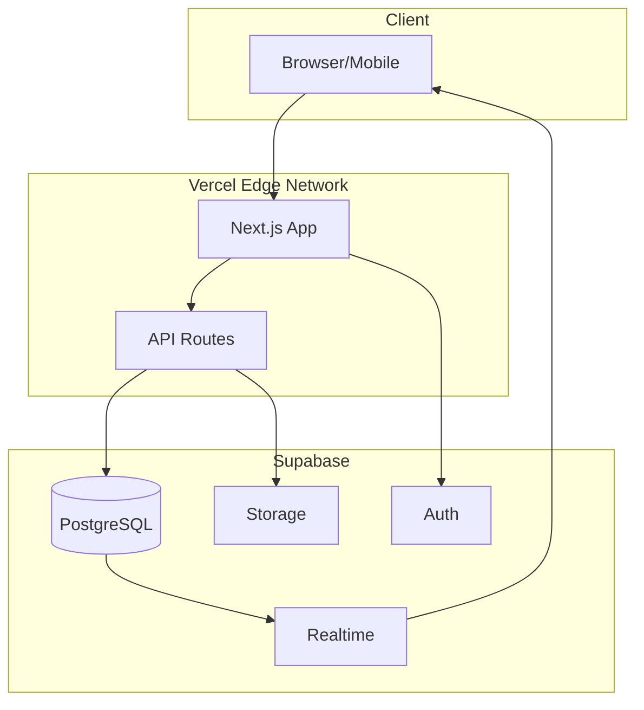
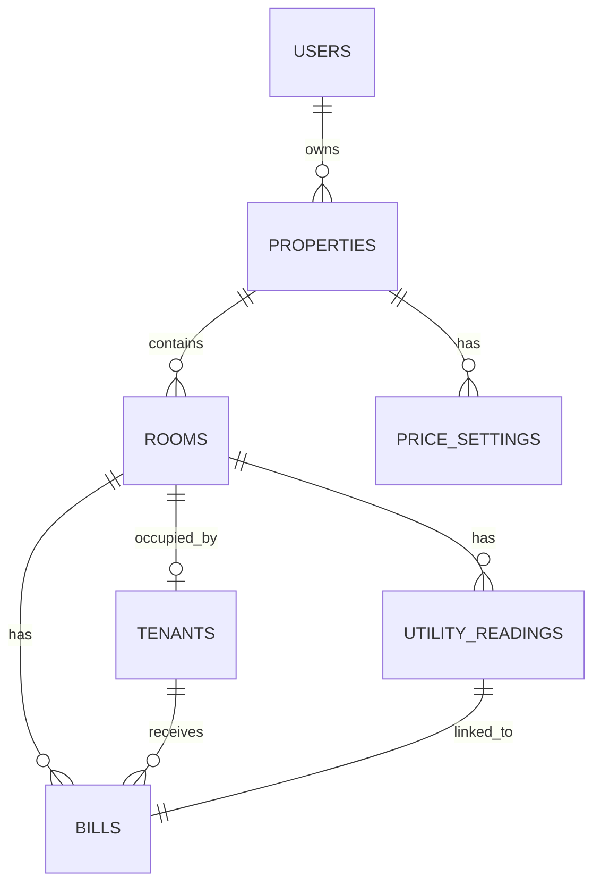
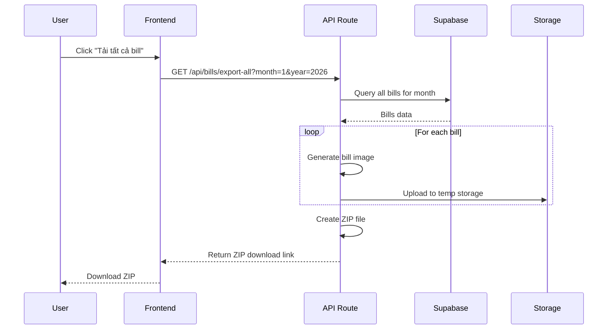
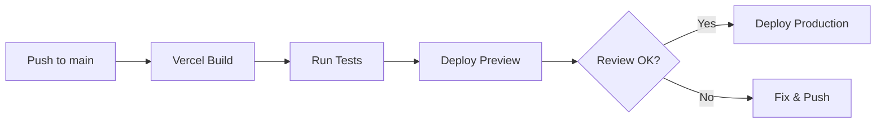

# Technical Requirements Document (TRD)
## Phần Mềm Quản Lý Nhà Trọ - RentManager

| Thông tin | Chi tiết |
|-----------|----------|
| **Version** | 1.1 |
| **Ngày cập nhật** | 2026-01-25 |
| **Tác giả** | Engineering Team |
| **Trạng thái** | Draft - Pending Review |

---

## 1. Tổng Quan Kiến Trúc

### 1.1 Technology Stack

| Layer | Technology | Lý do chọn |
|-------|------------|------------|
| **Frontend** | Next.js 14 (App Router) | SSR tốt, deploy Vercel dễ dàng |
| **Styling** | Tailwind CSS v3.4+ + shadcn/ui | UI đẹp, responsive, dễ customize |
| **Animations** | Framer Motion | Smooth transitions, micro-interactions |
| **Backend** | Next.js API Routes | Serverless, tích hợp sẵn với Vercel |
| **Database** | Supabase (PostgreSQL) | Realtime, Auth sẵn, free tier tốt |
| **Storage** | Supabase Storage | Lưu ảnh bill, CCCD |
| **Hosting** | Vercel | Free, auto deploy, edge network |
| **Auth** | Supabase Auth | Email/Password, có thể thêm Google |
| **PWA** | next-pwa | Offline support, installable |

### 1.2 Kiến Trúc Tổng Quan



---

## 2. Database Schema

### 2.1 Supabase Tables

```sql
-- Bảng profiles (Thông tin mở rộng của user)
CREATE TABLE profiles (
    id UUID PRIMARY KEY REFERENCES auth.users(id) ON DELETE CASCADE,
    full_name VARCHAR(255),
    avatar_url TEXT,
    phone_number VARCHAR(20),
    role VARCHAR(20) DEFAULT 'landlord', -- 'landlord', 'staff'
    created_at TIMESTAMPTZ DEFAULT NOW(),
    updated_at TIMESTAMPTZ DEFAULT NOW()
);

-- Bảng nhà trọ (1 user có thể quản lý nhiều nhà)
CREATE TABLE properties (
    id UUID PRIMARY KEY DEFAULT gen_random_uuid(),
    user_id UUID REFERENCES auth.users(id) ON DELETE CASCADE,
    name VARCHAR(255) NOT NULL,
    address TEXT,
    logo_url TEXT,
    created_at TIMESTAMPTZ DEFAULT NOW(),
    updated_at TIMESTAMPTZ DEFAULT NOW()
);

-- Bảng phòng trọ
CREATE TABLE rooms (
    id UUID PRIMARY KEY DEFAULT gen_random_uuid(),
    property_id UUID REFERENCES properties(id) ON DELETE CASCADE,
    name VARCHAR(100) NOT NULL,
    floor INTEGER DEFAULT 1,
    area DECIMAL(10,2), -- diện tích m²
    base_rent DECIMAL(15,2) NOT NULL, -- giá thuê cơ bản
    status VARCHAR(20) DEFAULT 'vacant', -- 'occupied', 'vacant'
    created_at TIMESTAMPTZ DEFAULT NOW(),
    updated_at TIMESTAMPTZ DEFAULT NOW()
);

-- Bảng người thuê
CREATE TABLE tenants (
    id UUID PRIMARY KEY DEFAULT gen_random_uuid(),
    room_id UUID REFERENCES rooms(id) ON DELETE SET NULL,
    full_name VARCHAR(255) NOT NULL,
    phone VARCHAR(20),
    email VARCHAR(255),
    id_card VARCHAR(20), -- CMND/CCCD
    id_card_image_url TEXT,
    move_in_date DATE,
    move_out_date DATE,
    is_active BOOLEAN DEFAULT TRUE,
    created_at TIMESTAMPTZ DEFAULT NOW(),
    updated_at TIMESTAMPTZ DEFAULT NOW()
);

-- Bảng cấu hình đơn giá
CREATE TABLE price_settings (
    id UUID PRIMARY KEY DEFAULT gen_random_uuid(),
    property_id UUID REFERENCES properties(id) ON DELETE CASCADE,
    electricity_price DECIMAL(10,2) NOT NULL, -- đ/kWh
    water_price DECIMAL(10,2) NOT NULL, -- đ/m³
    service_fee DECIMAL(15,2) DEFAULT 0, -- phí dịch vụ cố định
    wifi_fee DECIMAL(15,2) DEFAULT 0,
    garbage_fee DECIMAL(15,2) DEFAULT 0,
    effective_from DATE NOT NULL,
    created_at TIMESTAMPTZ DEFAULT NOW()
);

-- Bảng ghi số điện nước hàng tháng
CREATE TABLE utility_readings (
    id UUID PRIMARY KEY DEFAULT gen_random_uuid(),
    room_id UUID REFERENCES rooms(id) ON DELETE CASCADE,
    month INTEGER NOT NULL, -- 1-12
    year INTEGER NOT NULL,
    
    -- Số điện
    electricity_start DECIMAL(10,2) NOT NULL,
    electricity_end DECIMAL(10,2) NOT NULL,
    electricity_used DECIMAL(10,2) GENERATED ALWAYS AS (electricity_end - electricity_start) STORED,
    
    -- Số nước
    water_start DECIMAL(10,2) NOT NULL,
    water_end DECIMAL(10,2) NOT NULL,
    water_used DECIMAL(10,2) GENERATED ALWAYS AS (water_end - water_start) STORED,
    
    created_at TIMESTAMPTZ DEFAULT NOW(),
    updated_at TIMESTAMPTZ DEFAULT NOW(),
    
    UNIQUE(room_id, month, year)
);

-- Bảng hóa đơn (bills)
CREATE TABLE bills (
    id UUID PRIMARY KEY DEFAULT gen_random_uuid(),
    room_id UUID REFERENCES rooms(id) ON DELETE CASCADE,
    tenant_id UUID REFERENCES tenants(id) ON DELETE SET NULL,
    utility_reading_id UUID REFERENCES utility_readings(id),
    
    month INTEGER NOT NULL,
    year INTEGER NOT NULL,
    
    -- Chi tiết tiền
    room_rent DECIMAL(15,2) NOT NULL,
    electricity_amount DECIMAL(15,2) NOT NULL,
    water_amount DECIMAL(15,2) NOT NULL,
    service_fee DECIMAL(15,2) DEFAULT 0,
    other_fee DECIMAL(15,2) DEFAULT 0,
    other_fee_note TEXT,
    total_amount DECIMAL(15,2) NOT NULL,
    
    -- Trạng thái
    status VARCHAR(20) DEFAULT 'pending', -- 'pending', 'paid'
    paid_at TIMESTAMPTZ,
    
    -- Ảnh bill đã xuất
    bill_image_url TEXT,
    
    created_at TIMESTAMPTZ DEFAULT NOW(),
    updated_at TIMESTAMPTZ DEFAULT NOW(),
    
    UNIQUE(room_id, month, year)
);
```

### 2.2 Row Level Security (RLS)

```sql
-- Enable RLS cho tất cả tables
ALTER TABLE properties ENABLE ROW LEVEL SECURITY;
ALTER TABLE rooms ENABLE ROW LEVEL SECURITY;
ALTER TABLE tenants ENABLE ROW LEVEL SECURITY;
ALTER TABLE price_settings ENABLE ROW LEVEL SECURITY;
ALTER TABLE utility_readings ENABLE ROW LEVEL SECURITY;
ALTER TABLE bills ENABLE ROW LEVEL SECURITY;

-- Policy: User chỉ thấy data của mình
CREATE POLICY "Users can view own properties" ON properties
    FOR ALL USING (auth.uid() = user_id);

CREATE POLICY "Users can view own rooms" ON rooms
    FOR ALL USING (
        property_id IN (SELECT id FROM properties WHERE user_id = auth.uid())
    );

CREATE POLICY "Users can view own tenants" ON tenants
    FOR ALL USING (
        room_id IN (
            SELECT r.id FROM rooms r
            JOIN properties p ON r.property_id = p.id
            WHERE p.user_id = auth.uid()
        )
    );

CREATE POLICY "Users can view own price_settings" ON price_settings
    FOR ALL USING (
        property_id IN (SELECT id FROM properties WHERE user_id = auth.uid())
    );

CREATE POLICY "Users can view own utility_readings" ON utility_readings
    FOR ALL USING (
        room_id IN (
            SELECT r.id FROM rooms r
            JOIN properties p ON r.property_id = p.id
            WHERE p.user_id = auth.uid()
        )
    );

CREATE POLICY "Users can view own bills" ON bills
    FOR ALL USING (
        room_id IN (
            SELECT r.id FROM rooms r
            JOIN properties p ON r.property_id = p.id
            WHERE p.user_id = auth.uid()
        )
    );
```

### 2.3 Database Indexes

```sql
-- Performance indexes
CREATE INDEX idx_rooms_property_id ON rooms(property_id);
CREATE INDEX idx_rooms_status ON rooms(status);

CREATE INDEX idx_tenants_room_id ON tenants(room_id);
CREATE INDEX idx_tenants_is_active ON tenants(is_active);

CREATE INDEX idx_utility_readings_room_month_year 
    ON utility_readings(room_id, month, year);

CREATE INDEX idx_bills_room_month_year 
    ON bills(room_id, month, year);
CREATE INDEX idx_bills_status ON bills(status);
CREATE INDEX idx_bills_tenant_id ON bills(tenant_id);

CREATE INDEX idx_price_settings_property_effective 
    ON price_settings(property_id, effective_from DESC);
```

### 2.4 Entity Relationship Diagram



---

## 3. Cấu Trúc Project

```
rent-manager/
├── app/
│   ├── (auth)/
│   │   ├── login/page.tsx
│   │   └── register/page.tsx
│   ├── (dashboard)/
│   │   ├── layout.tsx
│   │   ├── page.tsx                    # Dashboard
│   │   ├── rooms/
│   │   │   ├── page.tsx                # Danh sách phòng
│   │   │   ├── [id]/page.tsx           # Chi tiết phòng
│   │   │   └── new/page.tsx            # Thêm phòng
│   │   ├── tenants/
│   │   │   ├── page.tsx
│   │   │   └── [id]/page.tsx
│   │   ├── utilities/
│   │   │   ├── page.tsx                # Nhập số điện nước
│   │   │   └── [month]/page.tsx
│   │   ├── bills/
│   │   │   ├── page.tsx                # Danh sách bills
│   │   │   ├── [id]/page.tsx           # Preview bill
│   │   │   └── export/page.tsx         # Xuất tất cả bills
│   │   └── settings/
│   │       └── page.tsx                # Cấu hình
│   ├── api/
│   │   ├── rooms/route.ts
│   │   ├── tenants/route.ts
│   │   ├── utilities/route.ts
│   │   ├── bills/
│   │   │   ├── route.ts
│   │   │   ├── generate/route.ts       # Tạo bill
│   │   │   └── export-all/route.ts     # Xuất tất cả
│   │   └── settings/route.ts
│   ├── layout.tsx
│   └── globals.css
├── components/
│   ├── ui/                             # shadcn components
│   ├── rooms/
│   │   ├── RoomCard.tsx
│   │   ├── RoomForm.tsx
│   │   └── RoomList.tsx
│   ├── bills/
│   │   ├── BillPreview.tsx
│   │   ├── BillTemplate.tsx            # Mẫu bill để render
│   │   └── ExportButton.tsx
│   ├── utilities/
│   │   ├── UtilityInputForm.tsx
│   │   └── UtilityTable.tsx
│   └── layout/
│       ├── Sidebar.tsx
│       ├── Header.tsx
│       └── DashboardLayout.tsx
├── lib/
│   ├── supabase/
│   │   ├── client.ts                   # Browser client
│   │   ├── server.ts                   # Server client
│   │   └── middleware.ts
│   ├── utils/
│   │   ├── bill-generator.ts           # Tạo ảnh bill
│   │   ├── formatters.ts               # Format tiền, ngày
│   │   └── validators.ts
│   └── types/
│       └── database.ts                 # Types từ Supabase
├── hooks/
│   ├── useRooms.ts
│   ├── useBills.ts
│   └── useUtilities.ts
├── public/
│   └── bill-template/
│       └── default-logo.png
├── middleware.ts                       # Auth middleware
├── package.json
├── tailwind.config.ts
└── next.config.js
```

---

## 4. API Endpoints

### 4.1 Rooms API

| Method | Endpoint | Mô tả |
|--------|----------|-------|
| GET | `/api/rooms` | Lấy danh sách phòng |
| POST | `/api/rooms` | Tạo phòng mới |
| GET | `/api/rooms/[id]` | Chi tiết phòng |
| PUT | `/api/rooms/[id]` | Cập nhật phòng |
| DELETE | `/api/rooms/[id]` | Xóa phòng |

### 4.2 Utilities API

| Method | Endpoint | Mô tả |
|--------|----------|-------|
| GET | `/api/utilities?month=1&year=2026` | Lấy số điện nước theo tháng |
| POST | `/api/utilities` | Nhập số điện nước |
| PUT | `/api/utilities/[id]` | Sửa số điện nước |

### 4.3 Bills API

| Method | Endpoint | Mô tả |
|--------|----------|-------|
| GET | `/api/bills?month=1&year=2026` | Danh sách bills theo tháng |
| POST | `/api/bills/generate` | Tạo bills tự động cho tháng |
| GET | `/api/bills/[id]` | Chi tiết bill |
| GET | `/api/bills/export-all?month=1&year=2026` | Xuất ZIP tất cả bills |

### 4.4 Error Response Format

```typescript
// lib/types/api.ts
interface ApiError {
  error: {
    code: string;          // 'VALIDATION_ERROR', 'NOT_FOUND', 'UNAUTHORIZED'
    message: string;       // User-friendly message
    details?: Record<string, string[]>;  // Field-level errors
  };
}

// HTTP Status Codes
// 200 - Success
// 201 - Created
// 400 - Bad Request (validation errors)
// 401 - Unauthorized
// 403 - Forbidden
// 404 - Not Found
// 500 - Internal Server Error
```

### 4.5 Validation (Zod Schema)

```typescript
// lib/validations/room.ts
import { z } from 'zod';

export const createRoomSchema = z.object({
  name: z.string().min(1, 'Tên phòng không được trống').max(100),
  floor: z.number().int().min(1).default(1),
  area: z.number().positive().optional(),
  base_rent: z.number().positive('Giá thuê phải lớn hơn 0'),
});

export const utilityReadingSchema = z.object({
  electricity_end: z.number().min(0),
  water_end: z.number().min(0),
}).refine(
  (data) => data.electricity_end >= 0,
  { message: 'Số điện cuối kỳ không hợp lệ' }
);
```

---

## 5. Tính Năng Xuất Bill

### 5.1 Bill Template Design

```tsx
// components/bills/BillTemplate.tsx
// Sử dụng html2canvas hoặc @react-pdf/renderer

interface BillData {
  roomName: string;
  tenantName: string;
  month: number;
  year: number;
  roomRent: number;
  electricityUsed: number;
  electricityPrice: number;
  electricityAmount: number;
  waterUsed: number;
  waterPrice: number;
  waterAmount: number;
  serviceFee: number;
  totalAmount: number;
  propertyInfo: {
    name: string;
    address: string;
    phone: string;
    logo?: string;
  };
}
```

### 5.2 Export All Bills Flow



### 5.3 Thư viện sử dụng

| Chức năng | Thư viện | Mục đích |
|-----------|----------|----------|
| Render HTML to Image | `html2canvas` | Chuyển bill component thành ảnh |
| PDF Generation | `@react-pdf/renderer` | Tạo PDF (optional) |
| ZIP Files | `jszip` | Nén nhiều file bill |
| File Download | `file-saver` | Trigger download browser |

> [!NOTE]
> Trên mobile, `html2canvas` có thể chậm. Cân nhắc server-side rendering với Puppeteer cho production nếu cần.

---

## 6. Authentication Flow

### 6.1 Supabase Auth Integration

```tsx
// middleware.ts
import { createMiddlewareClient } from '@supabase/auth-helpers-nextjs';
import { NextResponse } from 'next/server';
import type { NextRequest } from 'next/server';

export async function middleware(req: NextRequest) {
  const res = NextResponse.next();
  const supabase = createMiddlewareClient({ req, res });
  const { data: { session } } = await supabase.auth.getSession();

  // Redirect to login nếu chưa auth
  if (!session && req.nextUrl.pathname.startsWith('/dashboard')) {
    return NextResponse.redirect(new URL('/login', req.url));
  }

  return res;
}
```

---

## 7. Deployment

### 7.1 Vercel Configuration

```json
// vercel.json
{
  "framework": "nextjs",
  "regions": ["sin1"],  // Singapore region cho VN users
  "env": {
    "NEXT_PUBLIC_SUPABASE_URL": "@supabase_url",
    "NEXT_PUBLIC_SUPABASE_ANON_KEY": "@supabase_anon_key",
    "SUPABASE_SERVICE_ROLE_KEY": "@supabase_service_role_key"
  }
}
```

### 7.2 Environment Variables

| Variable | Mô tả | Visibility |
|----------|-------|------------|
| `NEXT_PUBLIC_SUPABASE_URL` | Supabase project URL | Public |
| `NEXT_PUBLIC_SUPABASE_ANON_KEY` | Supabase anon key | Public |
| `SUPABASE_SERVICE_ROLE_KEY` | Service role key | Server only |

### 7.3 CI/CD Pipeline



---

## 8. Performance Considerations

### 8.1 Optimizations

| Aspect | Strategy |
|--------|----------|
| **Database** | Index trên `room_id`, `month`, `year` |
| **Images** | Lazy loading, WebP format |
| **API** | Pagination cho danh sách lớn |
| **Caching** | SWR/React Query cho client |
| **Bundle** | Dynamic imports cho bill generation |

### 8.2 Scalability

- Supabase PostgreSQL tự scale
- Vercel serverless functions auto-scale
- Storage sử dụng Supabase CDN

---

## 9. Security Checklist

- [x] Row Level Security (RLS) enabled
- [x] HTTPS everywhere (Vercel default)
- [x] Environment variables cho secrets
- [x] Input validation server-side
- [x] SQL injection prevention (Supabase client)
- [x] XSS protection (Next.js default)
- [ ] Rate limiting (Vercel config)

---

## 10. Testing Strategy

### 10.1 Unit Tests (Vitest)

```typescript
// __tests__/utils/formatters.test.ts
import { formatCurrency, formatDate } from '@/lib/utils/formatters';

describe('formatCurrency', () => {
  it('formats VND correctly', () => {
    expect(formatCurrency(3000000)).toBe('3.000.000 đ');
  });
});
```

### 10.2 Integration Tests

| Test Case | Description |
|-----------|-------------|
| Room CRUD | Tạo, sửa, xóa phòng |
| Utility Input | Nhập số điện nước, validate |
| Bill Generation | Tạo bill tự động, kiểm tra tính toán |
| Export | Xuất ZIP, kiểm tra file |

### 10.3 E2E Tests (Playwright)

```typescript
// e2e/bill-flow.spec.ts
import { test, expect } from '@playwright/test';

test('complete bill generation flow', async ({ page }) => {
  await page.goto('/login');
  await page.fill('[name=email]', 'test@example.com');
  await page.fill('[name=password]', 'password');
  await page.click('button[type=submit]');
  
  await expect(page).toHaveURL('/dashboard');
  
  // Navigate to utilities
  await page.click('text=Điện Nước');
  // ... more test steps
});
```

### 10.4 Test Coverage Goals

| Type | Coverage Target |
|------|----------------|
| Unit Tests | ≥ 70% |
| Integration | Critical paths |
| E2E | Happy paths + Edge cases |

---

## 11. Development Timeline

| Phase | Duration | Deliverables |
|-------|----------|--------------|
| **Setup** | 1 ngày | Project init, Supabase setup, Auth |
| **Core Features** | 3-4 ngày | Rooms, Tenants, Utilities CRUD |
| **Bill Generation** | 2 ngày | Bill template, Generate, Preview |
| **Export Feature** | 1 ngày | Export 1 click, ZIP download |
| **Responsive/PWA** | 1-2 ngày | Mobile layout, PWA setup |
| **Polish** | 1-2 ngày | UI/UX polish, Testing |
| **Deploy** | 0.5 ngày | Vercel deploy, Domain setup |

> [!TIP]
> **Tổng thời gian ước tính MVP**: 10-12 ngày phát triển

---

## 12. Responsive & Mobile Web Strategy

### 11.1 Breakpoints (Tailwind Default + Custom)

| Breakpoint | Size | Device Target | Layout |
|------------|------|---------------|--------|
| `xs` | <640px | Phones | Single column, bottom nav |
| `sm` | ≥640px | Large phones | Single column, bottom nav |
| `md` | ≥768px | Tablets | 2 columns, collapsible sidebar |
| `lg` | ≥1024px | Laptops | Fixed sidebar, 3 columns |
| `xl` | ≥1280px | Desktops | Wide sidebar, multi-panel |

### 11.2 Mobile-First UI Patterns

```
┌─────────────────────────────────────┐
│  📱 MOBILE LAYOUT (<768px)          │
├─────────────────────────────────────┤
│  ┌─────────────────────────────┐    │
│  │     Header (sticky)         │    │
│  │   🏠 RentManager   [👤]     │    │
│  └─────────────────────────────┘    │
│                                     │
│  ┌─────────────────────────────┐    │
│  │                             │    │
│  │      Main Content           │    │
│  │   (Full-width cards)        │    │
│  │      Scrollable             │    │
│  │                             │    │
│  └─────────────────────────────┘    │
│                                     │
│  ┌─────────────────────────────┐    │
│  │ [🏠] [👤] [⚡] [📄] [⚙️]    │    │
│  │     Bottom Navigation       │    │
│  └─────────────────────────────┘    │
│                 ⊕ FAB               │
└─────────────────────────────────────┘
```

### 11.3 Component Patterns theo Platform

| Component | Desktop | Mobile |
|-----------|---------|--------|
| **Navigation** | Sidebar cố định | Bottom navigation bar |
| **Forms** | Modal centered | Full-screen sheet từ dưới lên |
| **Tables** | Full table với columns | Cards hoặc horizontal scroll |
| **Actions** | Buttons trong header | FAB (Floating Action Button) |
| **Filters** | Inline filters | Bottom sheet với filters |
| **Delete/Edit** | Dropdown menu | Swipe to reveal actions |

### 11.4 Touch & Gesture Support

| Gesture | Action | Component |
|---------|--------|----------|
| **Swipe Left** | Reveal delete/edit buttons | List items |
| **Swipe Down** | Pull to refresh | All lists |
| **Long Press** | Select multiple items | Room/Bill cards |
| **Pinch** | Zoom bill preview | Bill preview |

---

## 13. PWA Configuration

### 12.1 next-pwa Setup

```javascript
// next.config.js
const withPWA = require('next-pwa')({
  dest: 'public',
  disable: process.env.NODE_ENV === 'development',
  register: true,
  skipWaiting: true,
});

module.exports = withPWA({
  // Next.js config
});
```

### 12.2 Web App Manifest

```json
// public/manifest.json
{
  "name": "RentManager - Quản Lý Nhà Trọ",
  "short_name": "RentManager",
  "description": "Phần mềm quản lý nhà trọ, xuất bill tự động",
  "start_url": "/",
  "display": "standalone",
  "background_color": "#0f172a",
  "theme_color": "#3b82f6",
  "orientation": "portrait",
  "icons": [
    { "src": "/icons/icon-192.png", "sizes": "192x192", "type": "image/png" },
    { "src": "/icons/icon-512.png", "sizes": "512x512", "type": "image/png" }
  ]
}
```

### 12.3 iOS Safari Meta Tags

```html
<!-- app/layout.tsx -->
<meta name="apple-mobile-web-app-capable" content="yes" />
<meta name="apple-mobile-web-app-status-bar-style" content="black-translucent" />
<meta name="apple-mobile-web-app-title" content="RentManager" />
<link rel="apple-touch-icon" href="/icons/apple-touch-icon.png" />
```

---

## 14. UI Component & Design System

### 13.1 Color Palette

```css
/* globals.css - CSS Variables */
:root {
  /* Primary - Blue gradient */
  --primary: 221.2 83.2% 53.3%;
  --primary-gradient: linear-gradient(135deg, #3b82f6 0%, #8b5cf6 100%);
  
  /* Semantic colors */
  --success: 142.1 76.2% 36.3%;
  --warning: 38 92% 50%;
  --destructive: 0 84.2% 60.2%;
  
  /* Backgrounds */
  --background: 0 0% 100%;
  --card: 0 0% 100%;
}

.dark {
  --background: 222.2 84% 4.9%;
  --card: 222.2 84% 6%;
}
```

### 13.2 Typography Scale

| Element | Size | Weight | Usage |
|---------|------|--------|-------|
| **h1** | 2.25rem | 700 | Page titles |
| **h2** | 1.5rem | 600 | Section headers |
| **h3** | 1.25rem | 600 | Card titles |
| **body** | 1rem | 400 | Default text |
| **small** | 0.875rem | 400 | Secondary text |

### 13.3 Spacing System (8px base)

- `space-1`: 4px
- `space-2`: 8px  
- `space-3`: 12px
- `space-4`: 16px
- `space-6`: 24px
- `space-8`: 32px

### 13.4 shadcn/ui Components cần customize

| Component | Customization |
|-----------|---------------|
| `Button` | Gradient variant, larger touch target |
| `Card` | Subtle shadow, hover lift effect |
| `Input` | Larger font size on mobile (16px để tránh zoom) |
| `Sheet` | Full-height trên mobile |
| `Skeleton` | Shimmer animation |
| `Toast` | Bottom position trên mobile |

### 13.5 Animation Guidelines (Framer Motion)

```typescript
// lib/animations.ts
export const pageTransition = {
  initial: { opacity: 0, y: 20 },
  animate: { opacity: 1, y: 0 },
  exit: { opacity: 0, y: -20 },
  transition: { duration: 0.3 }
};

export const cardHover = {
  whileHover: { scale: 1.02, y: -4 },
  transition: { type: "spring", stiffness: 300 }
};

export const staggerChildren = {
  animate: { transition: { staggerChildren: 0.1 } }
};
```

---

## 15. Project Structure (Final)

```
rent-manager/
├── app/
│   ├── (auth)/
│   ├── (dashboard)/
│   │   ├── layout.tsx              # Responsive layout switcher
│   │   └── ...
│   ├── manifest.ts                 # PWA manifest
│   └── globals.css                 # Design tokens
├── components/
│   ├── ui/                         # shadcn + custom
│   ├── layout/
│   │   ├── Sidebar.tsx             # Desktop navigation
│   │   ├── BottomNav.tsx           # Mobile navigation ⭐
│   │   ├── MobileHeader.tsx        # Mobile header ⭐
│   │   └── ResponsiveLayout.tsx    # Layout switcher ⭐
│   ├── mobile/                     # Mobile-specific ⭐
│   │   ├── BottomSheet.tsx
│   │   ├── SwipeableCard.tsx
│   │   └── FAB.tsx
│   └── ...
├── hooks/
│   ├── useMediaQuery.ts            # Responsive hook ⭐
│   ├── useSwipeGesture.ts          # Gesture hook ⭐
│   └── ...
├── lib/
│   ├── animations.ts               # Framer Motion presets ⭐
│   └── ...
├── public/
│   ├── icons/                      # PWA icons ⭐
│   ├── manifest.json               # PWA manifest ⭐
│   └── sw.js                       # Service worker (auto-generated)
└── ...
```

> [!IMPORTANT]
> Các file đánh dấu ⭐ là bổ sung mới cho responsive/mobile support
