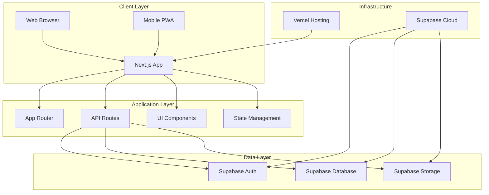
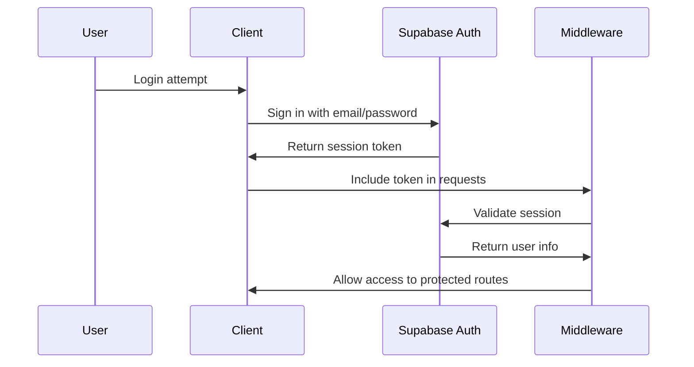
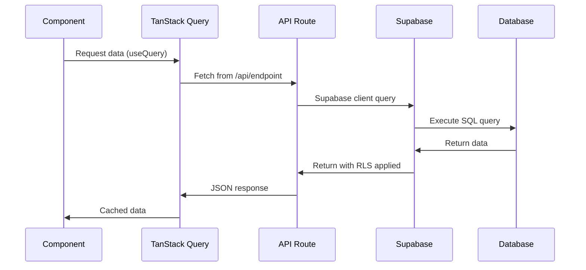
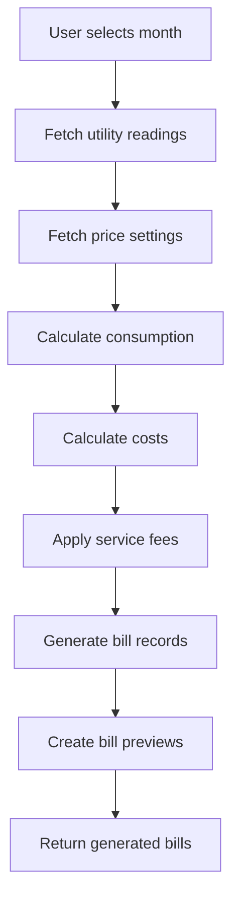
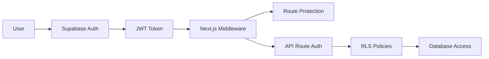
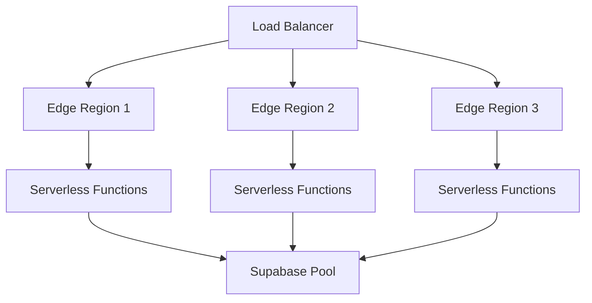

# System Architecture - RentManager

**Version:** 1.0  
**Last Updated:** 2026-01-28  
**Purpose:** Technical architecture overview and design decisions

---

## Overview

RentManager follows a modern serverless architecture with Next.js 14 App Router, Supabase for backend services, and a component-based frontend architecture.

---

## High-Level Architecture



---

## Technology Stack Architecture

### Frontend Architecture

```
┌─────────────────────────────────────────────────────────────┐
│                        Next.js 14 App                        │
├─────────────────────────────────────────────────────────────┤
│  App Router (app/)                                           │
│  ├── layout.tsx          # Root layout with providers        │
│  ├── page.tsx            # Landing page                      │
│  ├── (auth)/             # Authentication group             │
│  │   ├── login/          # Login page                        │
│  │   └── register/       # Register page                   │
│  └── dashboard/          # Main dashboard (planned)         │
├─────────────────────────────────────────────────────────────┤
│  Components (components/)                                   │
│  ├── ui/                  # shadcn/ui base components        │
│  │   ├── button.tsx       # Button component                 │
│ │   ├── card.tsx         # Card component                   │
│  │   ├── form.tsx        # Form components                  │
│  │   ├── input.tsx       # Input component                  │
│  │   ├── label.tsx       # Label component                  │
│  │   └── sonner.tsx      # Toast notifications               │
│  ├── providers.tsx       # React Query & Theme providers     │
│  └── [feature components] # Feature-specific components       │
├─────────────────────────────────────────────────────────────┤
│  State Management                                           │
│  ├── TanStack Query        # Server state                    │
│  ├── React Hook Form       # Form state                     │
│  └── next-themes           # Theme state                     │
└─────────────────────────────────────────────────────────────┘
```

### Backend Architecture

```
┌─────────────────────────────────────────────────────────────┐
│                    Next.js API Routes                        │
├─────────────────────────────────────────────────────────────┤
│  /api/rooms/              # Room CRUD operations            │
│  ├── GET    /             # List all rooms                   │
│  ├── POST   /             # Create new room                 │
│  ├── PUT    /:id          # Update room                     │
│  └── DELETE /:id          # Delete room                     │
├─────────────────────────────────────────────────────────────┤
│  /api/tenants/            # Tenant CRUD operations          │
│  ├── GET    /             # List all tenants                │
│  ├── POST   /             # Create new tenant               │
│  ├── PUT    /:id          # Update tenant                   │
│  └── DELETE /:id          # Delete tenant                   │
├─────────────────────────────────────────────────────────────┤
│  /api/utilities/          # Utility readings                │
│  ├── POST   /readings     # Submit monthly readings         │
│  └── GET    /history      # Get readings history            │
├─────────────────────────────────────────────────────────────┤
│  /api/bills/              # Bill operations                  │
│  ├── POST   /generate     # Generate bills                  │
│  ├── GET    /:id/export   # Export single bill              │
│  └── GET    /export-all   # Bulk export all bills           │
└─────────────────────────────────────────────────────────────┘
```

### Database Architecture

```
┌─────────────────────────────────────────────────────────────┐
│                    Supabase PostgreSQL                       │
├─────────────────────────────────────────────────────────────┤
│  Core Tables                                                  │
│  ├── profiles            # User profiles                     │
│  ├── properties          # Rental properties                │
│  ├── rooms              # Individual rooms                   │
│  ├── tenants            # Tenant information                 │
│  ├── price_settings     # Utility pricing                    │
│  ├── utility_readings   # Monthly meter readings             │
│  └── bills              # Generated bills                    │
├─────────────────────────────────────────────────────────────┤
│  Security Features                                            │
│  ├── Row Level Security   # RLS policies on all tables       │
│  ├── Authentication       # Supabase Auth integration         │
│  └── Cascade Deletes     # Proper data relationships          │
└─────────────────────────────────────────────────────────────┘
```

---

## Data Flow Architecture

### Authentication Flow



### Data Fetching Flow



### Bill Generation Flow



---

## Component Architecture

### Component Hierarchy

```
AppLayout
├── Header
│   ├── Logo
│   ├── Navigation
│   └── UserMenu
├── Sidebar
│   ├── MenuItems
│   └── UserInfo
└── MainContent
    ├── Dashboard
    ├── RoomManagement
    │   ├── RoomList
    │   │   └── RoomCard
    │   └── RoomForm
    ├── TenantManagement
    │   ├── TenantList
    │   │   └── TenantCard
    │   └── TenantForm
    ├── UtilityReadings
    │   └── ReadingsForm
    └── BillManagement
        ├── BillList
        │   └── BillCard
        └── BillPreview
```

### State Management Architecture

```
┌─────────────────────────────────────────────────────────────┐
│  Global State (React Query)                                  │
│  ├── useRooms()           # Room data                       │
│  ├── useTenants()         # Tenant data                     │
│  ├── useBills()           # Bill data                       │
│  └── useSettings()        # App settings                    │
├─────────────────────────────────────────────────────────────┤
│  Form State (React Hook Form)                                │
│  ├── roomForm             # Room creation/editing           │
│  ├── tenantForm           # Tenant creation/editing         │
│  └── readingsForm         # Utility readings input          │
├─────────────────────────────────────────────────────────────┤
│  UI State (useState)                                         │
│  ├── selectedRoom          # Currently selected room        │
│  ├── selectedTenant        # Currently selected tenant      │
│  ├── modalState           # Modal open/close states         │
│  └── theme                # Dark/light mode                  │
└─────────────────────────────────────────────────────────────┘
```

---

## Security Architecture

### Authentication & Authorization



### Security Layers

1. **Frontend Security**
   - HTTPS enforcement
   - XSS protection via Next.js
   - CSRF protection via SameSite cookies

2. **Authentication Security**
   - Supabase Auth with JWT tokens
   - Session management
   - Password hashing (handled by Supabase)

3. **API Security**
   - Route protection via middleware
   - Request validation with Zod
   - Rate limiting (planned)

4. **Database Security**
   - Row Level Security (RLS) on all tables
   - User isolation (users only see their data)
   - SQL injection prevention via Supabase client

---

## Performance Architecture

### Caching Strategy

```
┌─────────────────────────────────────────────────────────────┐
│  Caching Layers                                               │
├─────────────────────────────────────────────────────────────┤
│  Browser Cache                                                │
│  ├── Static assets (CSS, JS, images)                         │
│  ├── Service Worker (PWA)                                     │
│  └── HTTP Cache headers                                       │
├─────────────────────────────────────────────────────────────┤
│  Application Cache                                             │
│  ├── TanStack Query (server state)                            │
│  ├── React State (UI state)                                   │
│  └── Session Storage (user preferences)                       │
├─────────────────────────────────────────────────────────────┤
│  Database Cache                                                │
│  ├── Supabase Query Cache                                     │
│  ├── Database Indexes                                         │
│  └── Connection Pooling                                       │
└─────────────────────────────────────────────────────────────┘
```

### Optimization Techniques

1. **Code Splitting**
   - Automatic route-based splitting
   - Dynamic imports for heavy components
   - Lazy loading for non-critical features

2. **Bundle Optimization**
   - Tree shaking
   - Minification
   - Compression (gzip/brotli)

3. **Image Optimization**
   - Next.js Image component
   - Responsive images
   - WebP format support

4. **Database Optimization**
   - Proper indexing
   - Query optimization
   - Connection pooling

---

## Deployment Architecture

### Production Environment

```
┌─────────────────────────────────────────────────────────────┐
│                        Vercel                                │
├─────────────────────────────────────────────────────────────┤
│  Edge Network                                                 │
│  ├── Global CDN                                              │
│  ├── Edge Functions                                          │
│  └── Automatic SSL                                           │
├─────────────────────────────────────────────────────────────┤
│  Serverless Functions                                         │
│  ├── Next.js App Router                                      │
│  ├── API Routes                                              │
│  └── Static Assets                                           │
├─────────────────────────────────────────────────────────────┤
│  Build & Deploy                                               │
│  ├── Automatic builds on git push                            │
│  ├── Preview deployments                                      │
│  └── Rollback capability                                     │
└─────────────────────────────────────────────────────────────┘
```

### Database Deployment

```
┌─────────────────────────────────────────────────────────────┐
│                    Supabase Cloud                            │
├─────────────────────────────────────────────────────────────┤
│  Managed PostgreSQL                                           │
│  ├── Automatic backups                                        │
│  ├── Point-in-time recovery                                  │
│  └── High availability                                        │
├─────────────────────────────────────────────────────────────┤
│  Supabase Services                                            │
│  ├── Authentication                                          │
│  ├── Storage (for files)                                     │
│  └── Edge Functions (if needed)                              │
└─────────────────────────────────────────────────────────────┘
```

---

## Monitoring & Observability

### Performance Monitoring

1. **Frontend Monitoring**
   - Web Vitals (Core Web Vitals)
   - Error tracking (planned: Sentry)
   - User analytics (planned)

2. **Backend Monitoring**
   - API response times
   - Error rates
   - Database performance

3. **Infrastructure Monitoring**
   - Vercel Analytics
   - Supabase Dashboard
   - Uptime monitoring

---

## Scalability Architecture

### Horizontal Scaling



### Scaling Considerations

1. **Database Scaling**
   - Read replicas (if needed)
   - Connection pooling
   - Query optimization

2. **Application Scaling**
   - Serverless auto-scaling
   - Edge distribution
   - CDN caching

3. **File Storage Scaling**
   - Supabase Storage auto-scaling
   - CDN distribution
   - Image optimization

---

## Development Architecture

### Development Workflow

```
┌─────────────────────────────────────────────────────────────┐
│  Local Development                                            │
├─────────────────────────────────────────────────────────────┤
│  Git Workflow                                                 │
│  ├── Feature branches                                         │
│  ├── Pull requests                                           │
│  └── Code reviews                                            │
├─────────────────────────────────────────────────────────────┤
│  Development Tools                                            │
│  ├── Next.js Dev Server                                      │
│  ├── Supabase Local                                         │
│  ├── TypeScript                                             │
│  └── ESLint                                                 │
├─────────────────────────────────────────────────────────────┤
│  Testing Strategy                                             │
│  ├── Unit Tests (Vitest)                                     │
│  ├── Integration Tests                                      │
│  └── E2E Tests (Playwright)                                 │
└─────────────────────────────────────────────────────────────┘
```

---

## Architecture Decisions & Rationale

### Key Decisions

1. **Next.js 14 App Router**
   - **Why:** Latest features, better performance, improved DX
   - **Trade-offs:** Learning curve, ecosystem maturity

2. **Supabase as Backend**
   - **Why:** All-in-one solution, PostgreSQL, built-in auth
   - **Trade-offs:** Vendor lock-in, limited customization

3. **TypeScript Everywhere**
   - **Why:** Type safety, better developer experience
   - **Trade-offs:** Initial setup complexity

4. **Serverless Architecture**
   - **Why:** Cost-effective, auto-scaling, managed infrastructure
   - **Trade-offs:** Cold starts, execution limits

5. **Tailwind CSS + shadcn/ui**
   - **Why:** Rapid development, consistent design system
   - **Trade-offs:** Learning curve, CSS bundle size

---

## Future Architecture Considerations

### Potential Enhancements

1. **Microservices Migration**
   - Split billing engine
   - Separate notification service
   - Dedicated analytics service

2. **Advanced Caching**
   - Redis integration
   - Database query caching
   - CDN edge caching

3. **Real-time Features**
   - WebSocket integration
   - Live notifications
   - Collaborative features

4. **Mobile App**
   - React Native development
   - Native performance
   - App store distribution

---

**Last Updated:** 2026-01-28 by LocTran
**Next Review:** After major feature completion or architecture changes