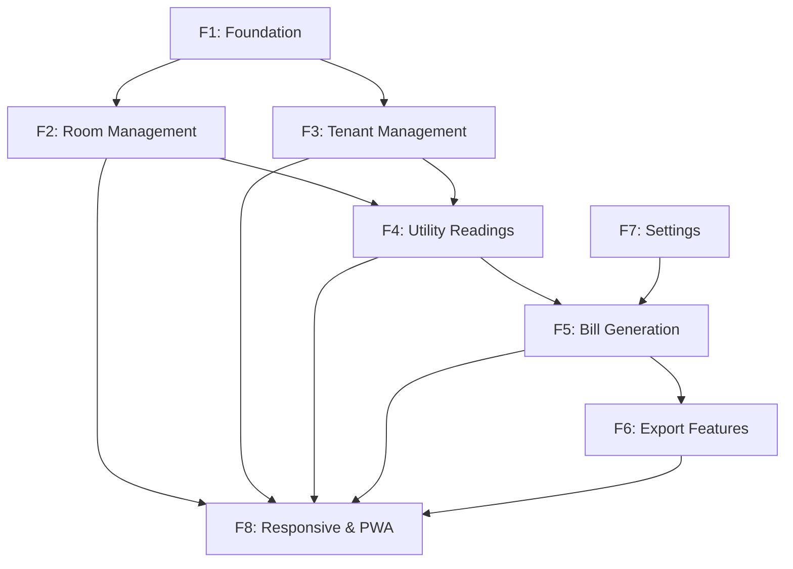

# Feature Tracker - RentManager

**Version:** 1.0  
**Last Updated:** 2026-01-28  
**Purpose:** Track implementation status of all features

---

## Overview

This document tracks the implementation status of all features defined in the PRD and TRD. Each feature includes requirements, implementation status, test coverage, and dependencies.

---

## Feature Status Summary

| Phase | Features | Complete | In Progress | Not Started |
|-------|----------|----------|-------------|-------------|
| **Phase 1** | Foundation | 4/4 | 0 | 0 |
| **Phase 2** | Room Management | 0/3 | 0 | 3 |
| **Phase 3** | Tenant Management | 0/3 | 0 | 3 |
| **Phase 4** | Utility Readings | 0/2 | 0 | 2 |
| **Phase 5** | Bill Generation | 0/3 | 0 | 3 |
| **Phase 6** | Export Features | 0/3 | 0 | 3 |
| **Phase 7** | Settings | 0/4 | 0 | 4 |
| **Phase 8** | Responsive & PWA | 0/4 | 0 | 4 |
| **Total** | **30 features** | **4** | **0** | **26** |

---

## Phase 1: Foundation ✅ COMPLETE

### F1.1 - Project Setup
- **Status:** ✅ Complete
- **Description:** Next.js 14 App Router with TypeScript
- **Files:** `app/layout.tsx`, `app/page.tsx`, `package.json`
- **Test Coverage:** N/A
- **Dependencies:** None

### F1.2 - Database Schema
- **Status:** ✅ Complete
- **Description:** PostgreSQL schema with 7 tables
- **Files:** `supabase/migrations/20260128000001_init_schema.sql`
- **Test Coverage:** N/A
- **Dependencies:** Supabase

### F1.3 - Authentication Infrastructure
- **Status:** ✅ Complete
- **Description:** Supabase Auth setup with middleware
- **Files:** `lib/supabase/`, `app/(auth)/`
- **Test Coverage:** N/A
- **Dependencies:** Supabase

### F1.4 - UI Foundation
- **Status:** ✅ Complete
- **Description:** Tailwind CSS + shadcn/ui components
- **Files:** `components/ui/`, `app/globals.css`
- **Test Coverage:** N/A
- **Dependencies:** Tailwind, shadcn/ui

---

## Phase 2: Room Management ⏳ NOT STARTED

### F2.1 - Room List View
- **Status:** ⏳ Not Started
- **Description:** Display all rooms with basic info
- **Requirements:**
  - Show room number, status, current tenant
  - Search and filter capabilities
  - Responsive grid layout
- **API Endpoints:** `GET /api/rooms`
- **UI Components:** RoomCard, RoomList, SearchBar
- **Test Cases:** 
  - Display empty state
  - Search functionality
  - Filter by status
- **Dependencies:** F1.1, F1.2

### F2.2 - Room Creation Form
- **Status:** ⏳ Not Started
- **Description:** Add new room with validation
- **Requirements:**
  - Room number (unique per property)
  - Room type (single, double, etc.)
  - Monthly rent amount
  - Status (available, occupied)
- **API Endpoints:** `POST /api/rooms`
- **UI Components:** RoomForm, Form validation
- **Test Cases:**
  - Form validation
  - Duplicate room number error
  - Success feedback
- **Dependencies:** F2.1

### F2.3 - Room Edit/Delete
- **Status:** ⏳ Not Started
- **Description:** Modify room details or remove room
- **Requirements:**
  - Edit all room fields
  - Delete with confirmation
  - Cannot delete if occupied
- **API Endpoints:** `PUT /api/rooms/:id`, `DELETE /api/rooms/:id`
- **UI Components:** RoomEditForm, DeleteConfirmation
- **Test Cases:**
  - Edit validation
  - Delete occupied room error
  - Delete success
- **Dependencies:** F2.1, F2.2

---

## Phase 3: Tenant Management ⏳ NOT STARTED

### F3.1 - Tenant List View
- **Status:** ⏳ Not Started
- **Description:** Display all tenants with contact info
- **Requirements:**
  - Name, phone, email, current room
  - Search by name or phone
  - Show lease status
- **API Endpoints:** `GET /api/tenants`
- **UI Components:** TenantCard, TenantList
- **Test Cases:**
  - Display empty state
  - Search functionality
  - Lease status display
- **Dependencies:** F1.1, F1.2

### F3.2 - Tenant Creation Form
- **Status:** ⏳ Not Started
- **Description:** Add new tenant with room assignment
- **Requirements:**
  - Personal info (name, phone, email)
  - ID card upload
  - Room assignment
  - Lease start date
- **API Endpoints:** `POST /api/tenants`
- **UI Components:** TenantForm, FileUpload
- **Test Cases:**
  - Form validation
  - File upload
  - Room assignment
- **Dependencies:** F3.1, F2.1

### F3.3 - Tenant Edit/Delete
- **Status:** ⏳ Not Started
- **Description:** Modify tenant info or remove tenant
- **Requirements:**
  - Edit personal info
  - Change room assignment
  - Delete with lease end date
- **API Endpoints:** `PUT /api/tenants/:id`, `DELETE /api/tenants/:id`
- **UI Components:** TenantEditForm, DeleteConfirmation
- **Test Cases:**
  - Edit validation
  - Room change
  - Delete with lease end
- **Dependencies:** F3.1, F3.2

---

## Phase 4: Utility Readings ⏳ NOT STARTED

### F4.1 - Monthly Readings Input
- **Status:** ⏳ Not Started
- **Description:** Input electricity and water meter readings
- **Requirements:**
  - Select month/year
  - Input readings per room
  - Auto-calculate consumption
  - Validation (current > previous)
- **API Endpoints:** `POST /api/utilities/readings`
- **UI Components:** ReadingsForm, ReadingInput
- **Test Cases:**
  - Form validation
  - Auto-calculation
  - Error handling
- **Dependencies:** F2.1, F3.1

### F4.2 - Readings History
- **Status:** ⏳ Not Started
- **Description:** View historical readings and consumption
- **Requirements:**
  - Monthly consumption chart
  - Compare with previous months
  - Export readings data
- **API Endpoints:** `GET /api/utilities/history`
- **UI Components:** ReadingsChart, HistoryTable
- **Test Cases:**
  - Chart display
  - Data accuracy
  - Export functionality
- **Dependencies:** F4.1

---

## Phase 5: Bill Generation ⏳ NOT STARTED

### F5.1 - Bill Generation Engine
- **Status:** ⏳ Not Started
- **Description:** Generate bills from utility readings
- **Requirements:**
  - Calculate electricity cost
  - Calculate water cost
  - Add service fees
  - Apply discounts if any
- **API Endpoints:** `POST /api/bills/generate`
- **UI Components:** GenerateButton, ProgressIndicator
- **Test Cases:**
  - Calculation accuracy
  - Bulk generation
  - Error handling
- **Dependencies:** F4.1, F7.1

### F5.2 - Bill Preview
- **Status:** ⏳ Not Started
- **Description:** Preview bills before export
- **Requirements:**
  - Show bill layout
  - Edit bill details
  - Add custom notes
- **API Endpoints:** `GET /api/bills/:id/preview`
- **UI Components:** BillPreview, BillEditor
- **Test Cases:**
  - Preview accuracy
  - Edit functionality
  - Save changes
- **Dependencies:** F5.1

### F5.3 - Bill Management
- **Status:** ⏳ Not Started
- **Description:** View, edit, delete generated bills
- **Requirements:**
  - List all bills by month
  - Filter by status
  - Regenerate bills
- **API Endpoints:** `GET /api/bills`, `PUT /api/bills/:id`, `DELETE /api/bills/:id`
- **UI Components:** BillList, BillCard, BillActions
- **Test Cases:**
  - List display
  - Filter functionality
  - Regeneration
- **Dependencies:** F5.1, F5.2

---

## Phase 6: Export Features ⏳ NOT STARTED

### F6.1 - Single Bill Export
- **Status:** ⏳ Not Started
- **Description:** Export individual bill as PNG/PDF
- **Requirements:**
  - Choose format (PNG/PDF)
  - High quality export
  - Custom file naming
- **API Endpoints:** `GET /api/bills/:id/export`
- **UI Components:** ExportButton, FormatSelector
- **Test Cases:**
  - PNG export quality
  - PDF export quality
  - File naming
- **Dependencies:** F5.3

### F6.2 - Bulk Export
- **Status:** ⏳ Not Started
- **Description:** Export all bills as ZIP file
- **Requirements:**
  - Select month/year
  - Export all bills at once
  - Progress indicator
- **API Endpoints:** `GET /api/bills/export-all`
- **UI Components:** BulkExportButton, ProgressBar
- **Test Cases:**
  - ZIP creation
  - File completeness
  - Progress tracking
- **Dependencies:** F6.1

### F6.3 - Export History
- **Status:** ⏳ Not Started
- **Description:** Track export history and re-download
- **Requirements:**
  - List previous exports
  - Re-download files
  - Clean up old exports
- **API Endpoints:** `GET /api/exports/history`
- **UI Components:** ExportHistory, DownloadButton
- **Test Cases:**
  - History display
  - Re-download
  - Cleanup functionality
- **Dependencies:** F6.2

---

## Phase 7: Settings ⏳ NOT STARTED

### F7.1 - Price Settings
- **Status:** ⏳ Not Started
- **Description:** Configure electricity and water rates
- **Requirements:**
  - Set electricity price per kWh
  - Set water price per m³
  - Different rates for different tiers
- **API Endpoints:** `PUT /api/settings/prices`
- **UI Components:** PriceSettingsForm, TierConfig
- **Test Cases:**
  - Price validation
  - Tier configuration
  - Save functionality
- **Dependencies:** None

### F7.2 - Service Fees
- **Status:** ⏳ Not Started
- **Description:** Configure monthly service fees
- **Requirements:**
  - Set service fee amount
  - Per room or per property
  - Optional fees
- **API Endpoints:** `PUT /api/settings/fees`
- **UI Components:** FeeSettingsForm, FeeTypeSelector
- **Test Cases:**
  - Fee validation
  - Type selection
  - Save functionality
- **Dependencies:** F7.1

### F7.3 - Bill Templates
- **Status:** ⏳ Not Started
- **Description:** Customize bill appearance
- **Requirements:**
  - Choose template design
  - Add logo
  - Custom fields
- **API Endpoints:** `PUT /api/settings/templates`
- **UI Components:** TemplateSelector, LogoUpload
- **Test Cases:**
  - Template selection
  - Logo upload
  - Custom fields
- **Dependencies:** None

### F7.4 - Property Information
- **Status:** ⏳ Not Started
- **Description:** Manage property details
- **Requirements:**
  - Property name and address
  - Contact information
  - Bank details for payments
- **API Endpoints:** `PUT /api/settings/property`
- **UI Components:** PropertyForm, ContactForm
- **Test Cases:**
  - Form validation
  - Save functionality
  - Display accuracy
- **Dependencies:** None

---

## Phase 8: Responsive & PWA ⏳ NOT STARTED

### F8.1 - Mobile Responsive Design
- **Status:** ⏳ Not Started
- **Description:** Optimize for mobile devices
- **Requirements:**
  - Mobile-first design
  - Touch-friendly interface
  - Bottom navigation
- **UI Components:** MobileLayout, BottomNav
- **Test Cases:**
  - Mobile viewport
  - Touch interactions
  - Navigation usability
- **Dependencies:** All UI features

### F8.2 - Tablet Responsive Design
- **Status:** ⏳ Not Started
- **Description:** Optimize for tablet devices
- **Requirements:**
  - Adaptive layout
  - Collapsible sidebar
  - Touch and mouse support
- **UI Components:** TabletLayout, Sidebar
- **Test Cases:**
  - Tablet viewport
  - Sidebar behavior
  - Input methods
- **Dependencies:** F8.1

### F8.3 - PWA Configuration
- **Status:** ⏳ Not Started
- **Description:** Make app installable
- **Requirements:**
  - Service worker
  - App manifest
  - Offline support
- **Files:** `public/manifest.json`, `sw.js`
- **Test Cases:**
  - Install prompt
  - Offline functionality
  - App-like experience
- **Dependencies:** F8.1, F8.2

### F8.4 - Performance Optimization
- **Status:** ⏳ Not Started
- **Description:** Optimize app performance
- **Requirements:**
  - Lazy loading
  - Image optimization
  - Bundle optimization
- **Techniques:** Code splitting, caching, compression
- **Test Cases:**
  - Load time < 3s
  - First Contentful Paint < 1.5s
  - Lighthouse score > 90
- **Dependencies:** All features

---

## Implementation Dependencies

---

## Test Coverage Tracking

| Feature | Unit Tests | Integration Tests | E2E Tests | Coverage |
|---------|------------|-------------------|-----------|----------|
| Phase 1 | N/A | N/A | N/A | N/A |
| Phase 2 | 0% | 0% | 0% | 0% |
| Phase 3 | 0% | 0% | 0% | 0% |
| Phase 4 | 0% | 0% | 0% | 0% |
| Phase 5 | 0% | 0% | 0% | 0% |
| Phase 6 | 0% | 0% | 0% | 0% |
| Phase 7 | 0% | 0% | 0% | 0% |
| Phase 8 | 0% | 0% | 0% | 0% |

---

## Next Priority Features

### Immediate (This Week)
1. **F2.1** - Room List View
2. **F2.2** - Room Creation Form
3. **F3.1** - Tenant List View

### Short Term (Next 2 Weeks)
4. **F3.2** - Tenant Creation Form
5. **F4.1** - Monthly Readings Input
6. **F5.1** - Bill Generation Engine

### Medium Term (Next Month)
7. **F6.1** - Single Bill Export
8. **F7.1** - Price Settings
9. **F8.1** - Mobile Responsive Design

---

## Risk Assessment by Feature

| Feature | Risk Level | Risk Description | Mitigation |
|---------|------------|------------------|------------|
| F5.1 | High | Complex calculation logic | Unit tests, edge cases |
| F6.1 | High | Export performance | Test on mobile devices |
| F8.3 | Medium | PWA compatibility | Browser testing |
| F4.1 | Low | Data validation | Form validation rules |

---

**Last Updated:** 2026-01-28 by LocTran
**Next Review:** Weekly or after feature completion