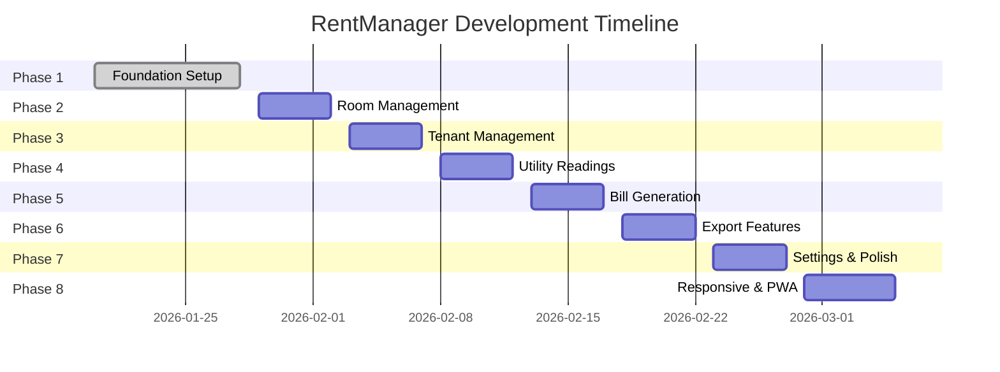

# Development Roadmap - RentManager

**Version:** 1.0  
**Last Updated:** 2026-01-28  
**Timeline:** January - February 2026

---

## Overview

This roadmap outlines the development phases, milestones, and timeline for the RentManager project. The plan is designed to deliver a functional MVP within 4-6 weeks while maintaining code quality and comprehensive testing.

---

## Project Timeline

---

## Phase Details

### Phase 1: Foundation ✅ COMPLETE
**Duration:** Jan 20-28, 2026 (9 days)  
**Status:** ✅ Complete

#### Completed Tasks
- [x] Next.js 14 App Router setup
- [x] TypeScript configuration
- [x] Tailwind CSS + shadcn/ui design system
- [x] Supabase database schema (7 tables)
- [x] Authentication infrastructure
- [x] Environment validation
- [x] Basic UI components (6 components)

#### Deliverables
- ✅ Working Next.js application
- ✅ Complete database schema
- ✅ Authentication system ready
- ✅ Design system established

---

### Phase 2: Room Management ⏳ NEXT
**Duration:** Jan 29 - Feb 2, 2026 (5 days)  
**Status:** ⏳ Not Started  
**Priority:** High

#### Objectives
Implement complete CRUD operations for room management with responsive UI.

#### Tasks
- [ ] **Day 1:** Room API endpoints
  - [ ] `GET /api/rooms` - List all rooms
  - [ ] `POST /api/rooms` - Create new room
  - [ ] `PUT /api/rooms/:id` - Update room
  - [ ] `DELETE /api/rooms/:id` - Delete room
- [ ] **Day 2:** Room List UI
  - [ ] RoomCard component
  - [ ] RoomList component
  - [ ] Search and filter functionality
  - [ ] Empty state handling
- [ ] **Day 3:** Room Form UI
  - [ ] RoomForm component
  - [ ] Form validation with Zod
  - [ ] Success/error feedback
  - [ ] Navigation between list/form
- [ ] **Day 4:** Room Edit/Delete
  - [ ] Edit form pre-population
  - [ ] Delete confirmation modal
  - [ ] Occupied room protection
- [ ] **Day 5:** Testing & Polish
  - [ ] Unit tests for API routes
  - [ ] Component tests
  - [ ] E2E tests for room workflows
  - [ ] UI polish and responsive design

#### Acceptance Criteria
- [ ] Can create, read, update, delete rooms
- [ ] Form validation prevents invalid data
- [ ] Cannot delete occupied rooms
- [ ] Search and filter work correctly
- [ ] Responsive design on mobile/tablet
- [ ] All tests passing

#### Dependencies
- Phase 1 foundation complete ✅

---

### Phase 3: Tenant Management ⏳ PLANNED
**Duration:** Feb 3-7, 2026 (5 days)  
**Status:** ⏳ Not Started  
**Priority:** High

#### Objectives
Implement tenant management with room assignment and contact information.

#### Tasks
- [ ] **Day 1:** Tenant API endpoints
  - [ ] `GET /api/tenants` - List all tenants
  - [ ] `POST /api/tenants` - Create new tenant
  - [ ] `PUT /api/tenants/:id` - Update tenant
  - [ ] `DELETE /api/tenants/:id` - Delete tenant
- [ ] **Day 2:** Tenant List UI
  - [ ] TenantCard component
  - [ ] TenantList component
  - [ ] Room assignment display
  - [ ] Contact information layout
- [ ] **Day 3:** Tenant Form UI
  - [ ] TenantForm component
  - [ ] Room assignment dropdown
  - [ ] File upload for ID cards
  - [ ] Contact information fields
- [ ] **Day 4:** Tenant Edit/Delete
  - [ ] Edit form with current data
  - [ ] Room reassignment
  - [ ] Lease end date on delete
- [ ] **Day 5:** Testing & Integration
  - [ ] Unit tests for tenant APIs
  - [ ] Component tests
  - [ ] Integration tests with rooms
  - [ ] E2E tests for tenant workflows

#### Acceptance Criteria
- [ ] Can create, read, update, delete tenants
- [ ] Room assignment works correctly
- [ ] File upload for ID cards functional
- [ ] Cannot delete tenants without lease end date
- [ ] Search by name or phone works
- [ ] All tests passing

#### Dependencies
- Phase 2: Room Management complete

---

### Phase 4: Utility Readings ⏳ PLANNED
**Duration:** Feb 8-12, 2026 (5 days)  
**Status:** ⏳ Not Started  
**Priority:** High

#### Objectives
Implement monthly utility readings input with automatic consumption calculation.

#### Tasks
- [ ] **Day 1:** Readings API endpoints
  - [ ] `POST /api/utilities/readings` - Submit readings
  - [ ] `GET /api/utilities/history` - Get history
  - [ ] Auto-calculation logic
  - [ ] Validation (current > previous)
- [ ] **Day 2:** Readings Form UI
  - [ ] ReadingsForm component
  - [ ] Month/year selector
  - [ ] Room-based input grid
  - [ ] Real-time validation
- [ ] **Day 3:** Consumption Calculation
  - [ ] Auto-calculation on input
  - [ ] Previous readings fetch
  - [ ] Consumption display
  - [ ] Error handling for invalid data
- [ ] **Day 4:** History View
  - [ ] ReadingsHistory component
  - [ ] Monthly consumption charts
  - [ ] Comparison with previous months
  - [ ] Export functionality
- [ ] **Day 5:** Testing & Validation
  - [ ] Unit tests for calculation logic
  - [ ] Form validation tests
  - [ ] Integration tests with database
  - [ ] E2E tests for readings workflow

#### Acceptance Criteria
- [ ] Can submit monthly readings for all rooms
- [ ] Auto-calculation works correctly
- [ ] Validation prevents invalid readings
- [ ] History view shows consumption trends
- [ ] All tests passing

#### Dependencies
- Phase 2: Room Management complete
- Phase 3: Tenant Management complete

---

### Phase 5: Bill Generation ⏳ PLANNED
**Duration:** Feb 13-17, 2026 (5 days)  
**Status:** ⏳ Not Started  
**Priority:** High

#### Objectives
Implement automatic bill generation from utility readings with customizable templates.

#### Tasks
- [ ] **Day 1:** Bill Generation API
  - [ ] `POST /api/bills/generate` - Generate bills
  - [ ] Calculation engine (electricity + water + fees)
  - [ ] Bill template rendering
  - [ ] Database bill creation
- [ ] **Day 2:** Bill Generation UI
  - [ ] GenerateButton component
  - [ ] Month/year selection
  - [ ] Progress indicator
  - [ ] Success/error feedback
- [ ] **Day 3:** Bill Preview
  - [ ] BillPreview component
  - [ ] Bill layout design
  - [ ] Edit bill details
  - [ ] Add custom notes
- [ ] **Day 4:** Bill Management
  - [ ] BillList component
  - [ ] Filter by month/status
  - [ ] Regenerate bills
  - [ ] Delete bills
- [ ] **Day 5:** Testing & Calculation
  - [ ] Unit tests for calculation logic
  - [ ] Template rendering tests
  - [ ] Integration tests with readings
  - [ ] E2E tests for bill generation

#### Acceptance Criteria
- [ ] Can generate bills for selected month
- [ ] Calculations are 100% accurate
- [ ] Can preview and edit bills
- [ ] Can regenerate bills if needed
- [ ] All tests passing

#### Dependencies
- Phase 4: Utility Readings complete
- Phase 7: Price Settings (partial)

---

### Phase 6: Export Features ⏳ PLANNED
**Duration:** Feb 18-22, 2026 (5 days)  
**Status:** ⏳ Not Started  
**Priority:** Medium

#### Objectives
Implement bill export functionality with multiple format support.

#### Tasks
- [ ] **Day 1:** Export Dependencies
  - [ ] Install html2canvas for PNG export
  - [ ] Install jsPDF for PDF export
  - [ ] Install JSZip for bulk export
  - [ ] Test export libraries
- [ ] **Day 2:** Single Bill Export
  - [ ] `GET /api/bills/:id/export` endpoint
  - [ ] PNG export functionality
  - [ ] PDF export functionality
  - [ ] Custom file naming
- [ ] **Day 3:** Bulk Export
  - [ ] `GET /api/bills/export-all` endpoint
  - [ ] ZIP file creation
  - [ ] Progress tracking
  - [ ] Error handling for large exports
- [ ] **Day 4:** Export UI
  - [ ] ExportButton component
  - [ ] Format selector
  - [ ] Bulk export interface
  - [ ] Download management
- [ ] **Day 5:** Testing & Performance
  - [ ] Export quality tests
  - [ ] Performance tests on mobile
  - [ ] Large dataset tests
  - [ ] E2E tests for export workflows

#### Acceptance Criteria
- [ ] Can export single bills in PNG/PDF
- [ ] Can export all bills as ZIP
- [ ] Export quality is high and readable
- [ ] Export works on mobile devices
- [ ] All tests passing

#### Dependencies
- Phase 5: Bill Generation complete

---

### Phase 7: Settings & Polish ⏳ PLANNED
**Duration:** Feb 23-27, 2026 (5 days)  
**Status:** ⏳ Not Started  
**Priority:** Medium

#### Objectives
Implement application settings and polish the user experience.

#### Tasks
- [ ] **Day 1:** Price Settings
  - [ ] `PUT /api/settings/prices` endpoint
  - [ ] PriceSettingsForm component
  - [ ] Tier configuration UI
  - [ ] Validation and save
- [ ] **Day 2:** Service Fees
  - [ ] `PUT /api/settings/fees` endpoint
  - [ ] FeeSettingsForm component
  - [ ] Fee type configuration
  - [ ] Optional fee handling
- [ ] **Day 3:** Property Information
  - [ ] `PUT /api/settings/property` endpoint
  - [ ] PropertyForm component
  - [ ] Contact information
  - [ ] Bank details
- [ ] **Day 4:** Bill Templates
  - [ ] Template selection UI
  - [ ] Logo upload functionality
  - [ ] Custom field configuration
  - [ ] Template preview
- [ ] **Day 5:** Polish & Testing
  - [ ] UI polish and animations
  - [ ] Error handling improvements
  - [ ] Settings validation tests
  - [ ] Integration tests

#### Acceptance Criteria
- [ ] Can configure electricity/water prices
- [ ] Can set service fees
- [ ] Can manage property information
- [ ] Can customize bill templates
- [ ] All settings persist correctly
- [ ] All tests passing

#### Dependencies
- Phase 5: Bill Generation complete

---

### Phase 8: Responsive & PWA ⏳ PLANNED
**Duration:** Feb 28 - Mar 5, 2026 (6 days)  
**Status:** ⏳ Not Started  
**Priority:** Medium

#### Objectives
Implement responsive design and PWA features for mobile experience.

#### Tasks
- [ ] **Day 1-2:** Mobile Responsive Design
  - [ ] Mobile layout optimization
  - [ ] Touch-friendly interface
  - [ ] Bottom navigation
  - [ ] Mobile-specific interactions
- [ ] **Day 3:** Tablet Responsive Design
  - [ ] Tablet layout adaptation
  - [ ] Collapsible sidebar
  - [ ] Touch and mouse support
  - [ ] Orientation handling
- [ ] **Day 4:** PWA Configuration
  - [ ] Install next-pwa
  - [ ] Configure service worker
  - [ ] Create app manifest
  - [ ] Offline support
- [ ] **Day 5:** Performance Optimization
  - [ ] Code splitting implementation
  - [ ] Image optimization
  - [ ] Bundle optimization
  - [ ] Caching strategy
- [ ] **Day 6:** Testing & Deployment
  - [ ] Cross-device testing
  - [ ] PWA testing
  - [ ] Performance testing
  - [ ] Deployment preparation

#### Acceptance Criteria
- [ ] App works perfectly on mobile devices
- [ ] Tablet experience is optimized
- [ ] PWA is installable and works offline
- [ ] Performance targets met (< 3s load time)
- [ ] Lighthouse score > 90
- [ ] All tests passing

#### Dependencies
- All previous phases complete

---

## Milestones

### Milestone 1: Core Management Complete ✅
**Target:** Feb 7, 2026  
**Includes:** Phase 1-3  
**Deliverables:**
- ✅ Foundation complete
- ⏳ Room management
- ⏳ Tenant management

### Milestone 2: Billing System Complete ⏳
**Target:** Feb 17, 2026  
**Includes:** Phase 4-5  
**Deliverables:**
- ⏳ Utility readings
- ⏳ Bill generation

### Milestone 3: Export & Settings Complete ⏳
**Target:** Feb 27, 2026  
**Includes:** Phase 6-7  
**Deliverables:**
- ⏳ Export features
- ⏳ Settings configuration

### Milestone 4: Production Ready ⏳
**Target:** Mar 5, 2026  
**Includes:** Phase 8  
**Deliverables:**
- ⏳ Responsive design
- ⏳ PWA features
- ⏳ Performance optimization

---

## Risk Management

### High Risk Items
1. **Bill Export Performance** (Phase 6)
   - **Risk:** Slow export on mobile devices
   - **Mitigation:** Test early, optimize rendering, consider server-side generation

2. **Calculation Accuracy** (Phase 5)
   - **Risk:** Incorrect bill calculations
   - **Mitigation:** Comprehensive unit tests, edge case handling, manual verification

### Medium Risk Items
1. **Mobile Performance** (Phase 8)
   - **Risk:** Poor performance on mobile
   - **Mitigation:** Regular performance testing, optimization, progressive enhancement

2. **PWA Compatibility** (Phase 8)
   - **Risk:** PWA features not working on all devices
   - **Mitigation:** Browser testing, fallback implementations, graceful degradation

---

## Success Metrics

### Technical Metrics
- **Code Coverage:** > 80%
- **Performance:** < 3s load time, < 1.5s FCP
- **Lighthouse Score:** > 90
- **Build Success:** 100% automated builds

### Product Metrics
- **Bill Generation Speed:** < 5 minutes for 10 rooms
- **Calculation Accuracy:** 100%
- **Export Success Rate:** > 95%
- **Mobile Usability:** 4+ star rating

---

## Resource Planning

### Development Resources
- **Developer:** 1 full-time
- **Hours per week:** 40 hours
- **Total development time:** ~160 hours

### Tools & Services
- **Development:** VS Code, Git, Node.js
- **Testing:** Vitest, Playwright
- **Deployment:** Vercel, Supabase
- **Monitoring:** Vercel Analytics, Supabase Dashboard

---

## Contingency Planning

### Timeline Buffer
- **Built-in buffer:** 1 week between phases
- **Total buffer time:** 2 weeks
- **Latest delivery:** March 12, 2026

### Scope Adjustments
If timeline constraints occur:
1. **Phase 8** can be simplified (basic responsive only)
2. **Export features** can be limited to single bill export
3. **Settings** can be basic configuration only

---

## Next Steps

### Immediate Actions (This Week)
1. Start Phase 2: Room Management
2. Set up testing infrastructure
3. Create development branch for Phase 2

### Short-term Actions (Next 2 Weeks)
1. Complete Phase 2-3
2. Set up CI/CD pipeline
3. Begin performance monitoring

### Long-term Actions (Next Month)
1. Complete all phases
2. Deploy to production
3. Gather user feedback

---

**Last Updated:** 2026-01-28 by LocTran
**Next Review:** Weekly progress updates